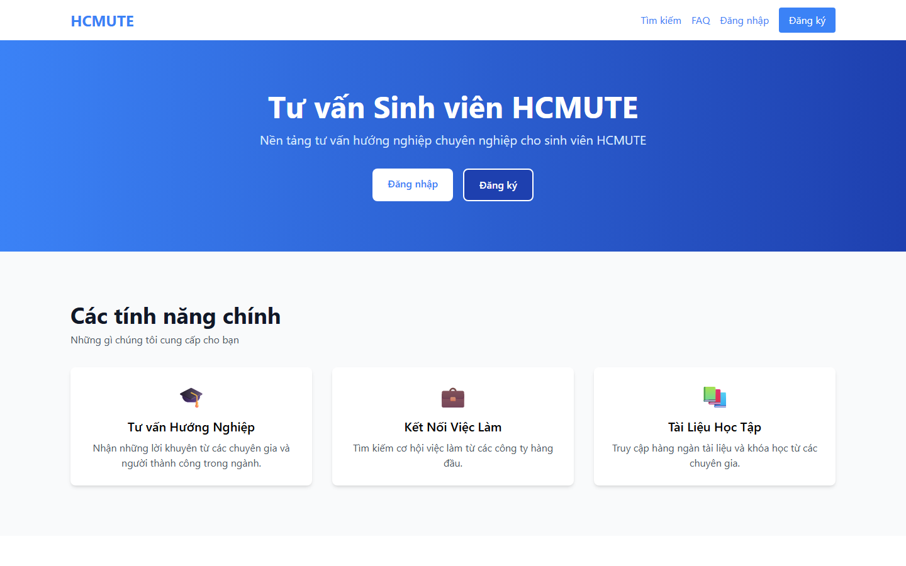
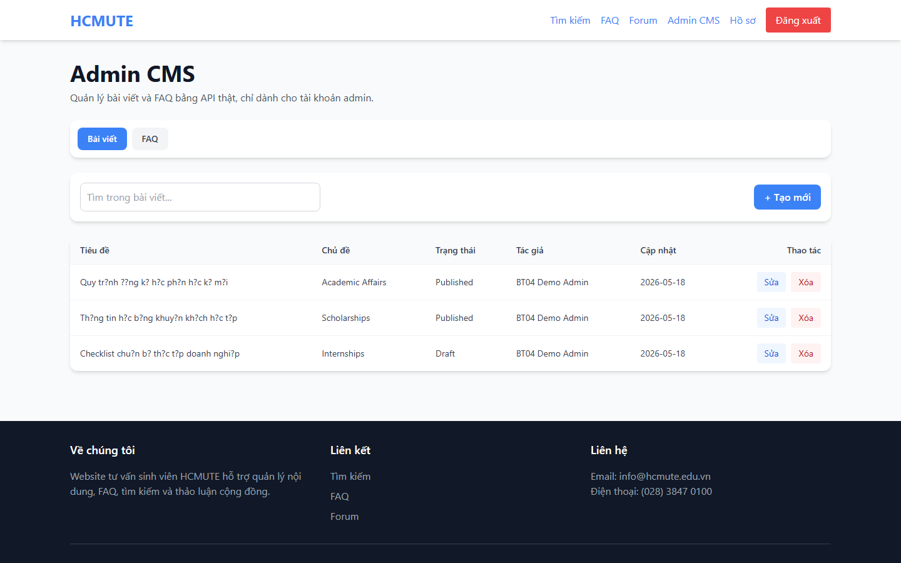
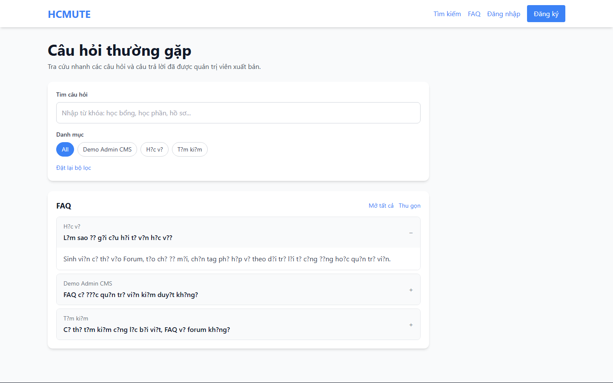
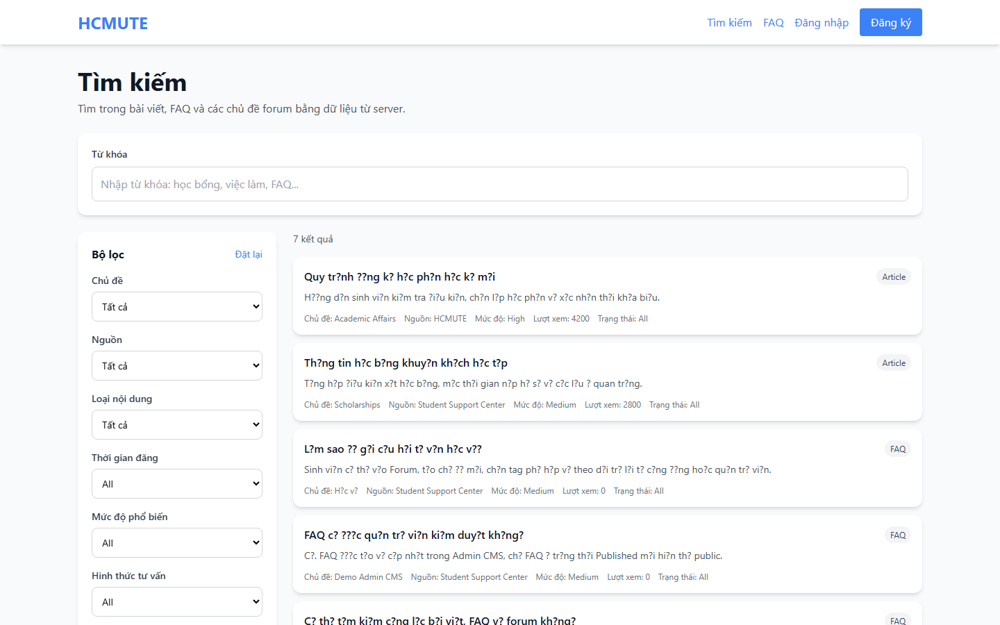
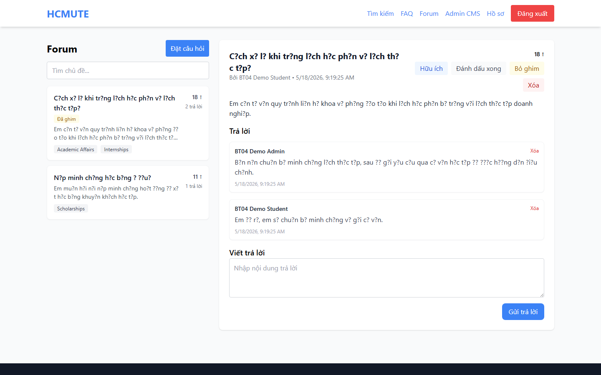

# BT04(Nhóm) - HCMUTE Student Consulting

**Sinh viên:** Đinh Nguyễn Đức Duy  
**MSSV:** 23110193  
**Nội dung phụ trách:** Admin CMS + FAQ + Search + Forum persistence & moderation

---

## Tổng Quan

Đây là phần bài nhóm của dự án **HCMUTE Student Consulting**, được đưa lên repo cá nhân với tên `BT04(Nhóm)-23110193_DinhNguyenDucDuy`. Dự án xây dựng nền tảng tư vấn sinh viên gồm backend Express/MongoDB và frontend React/Redux.

Phần triển khai tập trung vào các module quản trị nội dung và tương tác cộng đồng:

- **Admin CMS:** quản trị bài viết và FAQ bằng API thật, chỉ cho tài khoản admin.
- **FAQ:** hiển thị FAQ đã xuất bản, tìm kiếm và lọc theo danh mục.
- **Search:** tìm kiếm tập trung trên bài viết, FAQ và forum, có bộ lọc theo topic, khoa, loại nội dung, độ phổ biến và thời gian.
- **Forum persistence & moderation:** lưu chủ đề/thảo luận vào MongoDB, hỗ trợ tạo câu hỏi, trả lời, upvote, đánh dấu đã giải quyết, ghim/xóa chủ đề và xóa trả lời bởi admin.

---

## Demo Giao Diện

Ảnh demo được chụp từ môi trường local với backend `http://localhost:3000` và frontend `http://localhost:3001`.

| Home | Admin CMS |
|---|---|
|  |  |

| FAQ | Search |
|---|---|
|  |  |

| Forum |
|---|
|  |

Danh sách ảnh:

- `home.png`: trang chủ dự án tư vấn sinh viên.
- `admin-cms.png`: Admin CMS quản lý bài viết/FAQ bằng API thật.
- `faq.png`: FAQ public, có tìm kiếm và danh mục.
- `search.png`: tìm kiếm tập trung trên Article, FAQ và Forum.
- `forum.png`: forum có chủ đề, trả lời, upvote, solved, pin/delete cho admin.

---

## Chức Năng Chính

### Admin CMS

- Route frontend: `/admin/cms`
- API backend: `/api/admin/:resource`
- Quản lý hai loại tài nguyên: `articles` và `faqs`.
- Hỗ trợ CRUD: danh sách, tạo mới, cập nhật, xóa.
- Hỗ trợ tìm kiếm trong từng resource.
- Bảo vệ bằng middleware `verifyToken` và `verifyAdmin`.

### FAQ

- Route frontend: `/faq`
- API backend: `/api/faqs`
- Chỉ hiển thị FAQ có trạng thái `Published`.
- Lọc theo category.
- Tìm kiếm theo câu hỏi, câu trả lời và danh mục.
- UI gồm `FAQSearch` và `FAQAccordion`.

### Search

- Route frontend: `/search`
- API backend: `/api/search`
- Tìm kiếm trên ba nguồn dữ liệu: `Article`, `FAQ`, `ForumThread`.
- Hỗ trợ keyword `keyword` hoặc `q`.
- Hỗ trợ filter theo `topic`, `faculty`, `contentType`, `publishTime`, `popularity`, `counselingFormat`, `appointmentStatus`.
- UI gồm search bar, filter sidebar, filter chips và danh sách kết quả.

### Forum Persistence & Moderation

- Route frontend: `/forum`
- API backend: `/api/forum`
- Lưu chủ đề và trả lời bằng model `ForumThread`.
- Người dùng đã đăng nhập có thể tạo chủ đề, trả lời, upvote và đánh dấu chủ đề đã giải quyết.
- Chủ đề được sắp xếp ưu tiên theo `pinned`, sau đó theo `updatedAt`.
- Admin có thể ghim/bỏ ghim chủ đề, xóa chủ đề và xóa trả lời.

---

## Cấu Trúc Project

```text
BT04(Nhóm)-23110193_DinhNguyenDucDuy/
├── backend/
│   ├── src/
│   │   ├── controllers/
│   │   │   ├── adminController.js
│   │   │   ├── faqController.js
│   │   │   ├── forumController.js
│   │   │   └── searchController.js
│   │   ├── middleware/
│   │   │   ├── auth.js
│   │   │   ├── rateLimit.js
│   │   │   └── validator.js
│   │   ├── models/
│   │   │   ├── Article.js
│   │   │   ├── FAQ.js
│   │   │   ├── ForumThread.js
│   │   │   └── User.js
│   │   ├── routes/
│   │   │   ├── adminRoutes.js
│   │   │   ├── faqRoutes.js
│   │   │   ├── forumRoutes.js
│   │   │   └── searchRoutes.js
│   │   └── app.js
│   └── package.json
├── frontend/
│   ├── src/
│   │   ├── components/admin/
│   │   ├── components/faq/
│   │   ├── components/forum/
│   │   ├── components/search/
│   │   ├── pages/
│   │   │   ├── AdminPage.jsx
│   │   │   ├── FAQPage.jsx
│   │   │   ├── ForumPage.jsx
│   │   │   └── SearchPage.jsx
│   │   ├── redux/
│   │   └── services/api.js
│   └── package.json
├── docs/demo/                  # Ảnh demo dùng trong README
└── README.md
```

---

## API Chính

### Admin CMS

| Method | Endpoint | Mô tả |
|---|---|---|
| `GET` | `/api/admin/articles?q=` | Lấy danh sách bài viết trong CMS |
| `POST` | `/api/admin/articles` | Tạo bài viết |
| `PUT` | `/api/admin/articles/:id` | Cập nhật bài viết |
| `DELETE` | `/api/admin/articles/:id` | Xóa bài viết |
| `GET` | `/api/admin/faqs?q=` | Lấy danh sách FAQ trong CMS |
| `POST` | `/api/admin/faqs` | Tạo FAQ |
| `PUT` | `/api/admin/faqs/:id` | Cập nhật FAQ |
| `DELETE` | `/api/admin/faqs/:id` | Xóa FAQ |

### FAQ, Search, Forum

| Method | Endpoint | Mô tả |
|---|---|---|
| `GET` | `/api/faqs?category=&q=` | FAQ public đã xuất bản |
| `GET` | `/api/search?keyword=` | Tìm kiếm bài viết, FAQ và forum |
| `GET` | `/api/forum/threads?q=` | Danh sách chủ đề forum |
| `GET` | `/api/forum/threads/:id` | Chi tiết chủ đề |
| `POST` | `/api/forum/threads` | Tạo chủ đề mới |
| `POST` | `/api/forum/threads/:id/replies` | Tạo trả lời |
| `PATCH` | `/api/forum/threads/:id/upvote` | Upvote chủ đề |
| `PATCH` | `/api/forum/threads/:id/solved` | Đánh dấu đã giải quyết |
| `PATCH` | `/api/forum/threads/:id/pin` | Admin ghim/bỏ ghim chủ đề |
| `DELETE` | `/api/forum/threads/:id` | Admin xóa chủ đề |
| `DELETE` | `/api/forum/threads/:id/replies/:replyId` | Admin xóa trả lời |

---

## Tech Stack

| Layer | Công nghệ |
|---|---|
| Frontend | React 18, React Router DOM, Redux Toolkit, Tailwind CSS |
| Backend | Node.js, Express.js |
| Database | MongoDB, Mongoose |
| Auth | JWT, bcryptjs, cookie-parser |
| Email | Nodemailer |
| Security | CORS, express-rate-limit, express-validator |

---

## Cách Chạy Local

### 1. Backend

```bash
cd BT04(Nhóm)-23110193_DinhNguyenDucDuy/backend
npm install
npm run dev
```

Backend mặc định chạy tại:

```text
http://localhost:3000
```

File `backend/.env` cần có:

```env
PORT=3000
MONGO_URI=mongodb://127.0.0.1:27017/hcmute_student_consulting
ACCESS_TOKEN_SECRET=your_access_token_secret
CLIENT_URL=http://localhost:3001
EMAIL_USER=your_email@gmail.com
EMAIL_PASS=your_app_password
```

### 2. Frontend

```bash
cd BT04(Nhóm)-23110193_DinhNguyenDucDuy/frontend
npm install
npm start
```

Frontend mặc định chạy tại:

```text
http://localhost:3001
```

---

## Trang Demo Local

| Trang | URL |
|---|---|
| Home | `http://localhost:3001/` |
| Search | `http://localhost:3001/search` |
| FAQ | `http://localhost:3001/faq` |
| Forum | `http://localhost:3001/forum` |
| Admin CMS | `http://localhost:3001/admin/cms` |
| Profile | `http://localhost:3001/profile` |

---

## Ghi Chú

- Bản upload này đã loại trừ `.git`, `node_modules`, `build`, `dist`, `.env` và log.
- Admin CMS và moderation cần tài khoản có role `admin`.
- Forum tạo chủ đề/trả lời cần tài khoản đã đăng nhập.
