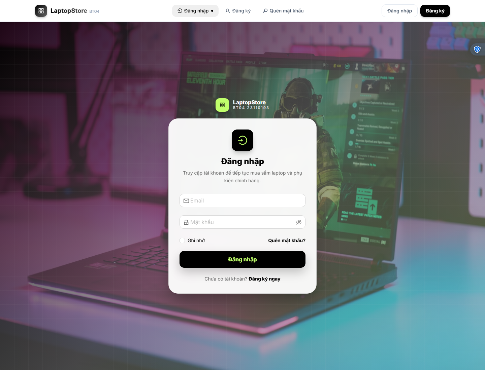
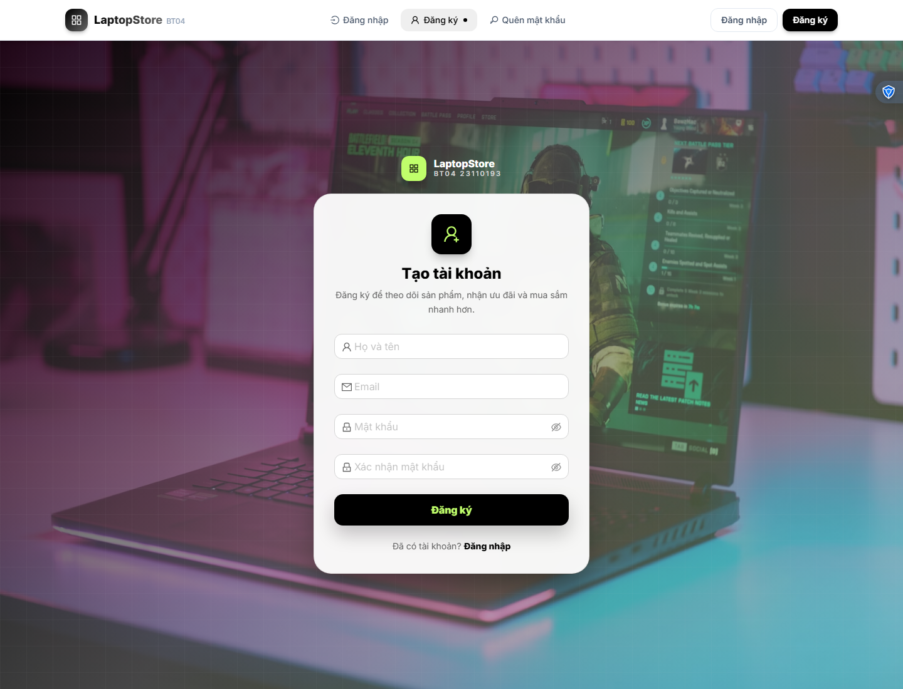
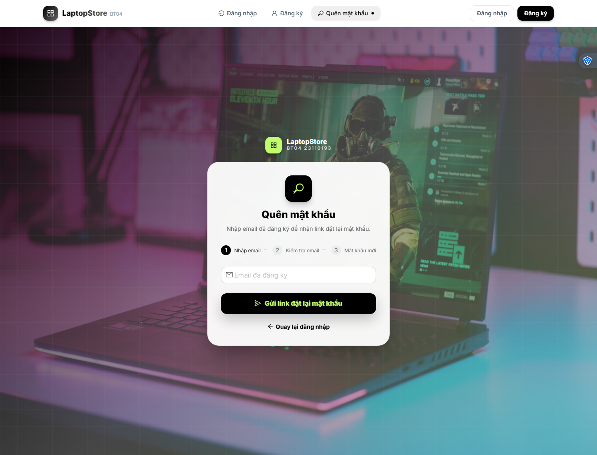
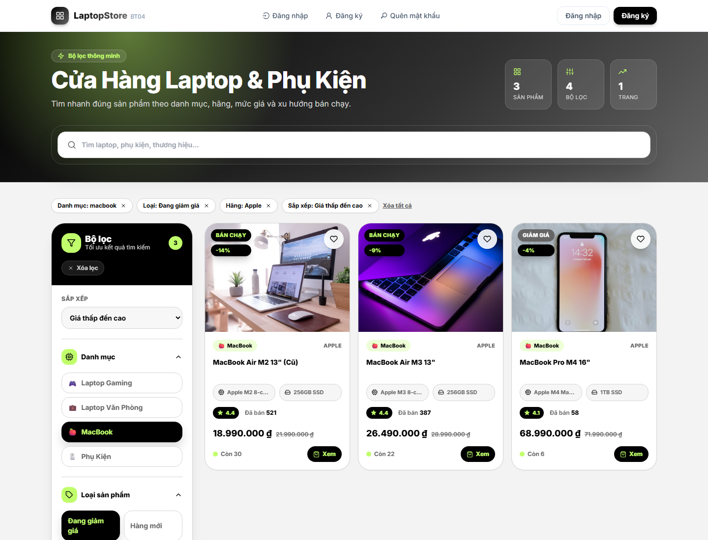

# BT04 — FullStack E-Commerce LaptopStore

<div align="center">

**Bài tập cá nhân môn Các Công Nghệ Phần Mềm Mới**<br>
**Sinh viên:** Đinh Nguyễn Đức Duy — **MSSV:** 23110193


</div>

---

## Tổng Quan

BT04 là ứng dụng **LaptopStore** fullstack gồm frontend React và backend Express/MongoDB. Project mở rộng từ phần quản lý người dùng ở BT03 thành một cửa hàng laptop/phụ kiện có đăng nhập, đăng ký, xác nhận email, quên mật khẩu, trang chủ sản phẩm, trang shop có lọc/sắp xếp/phân trang và trang chi tiết sản phẩm.

Giao diện hiện dùng bộ màu:

| Màu | Vai trò |
|---|---|
| `#000000` | Nền tối, CTA chính |
| `#656565` | Text phụ, bề mặt trung tính |
| `#D5D5D5` | Border, nền phụ |
| `#C0FF6B` | Accent, badge, trạng thái nổi bật |

---

## Demo Giao Diện

Ảnh demo được chụp từ môi trường local với frontend `http://localhost:5173` và backend `http://localhost:8080`.

| Đăng nhập | Đăng ký |
|---|---|
|  |  |

| Quên mật khẩu | Shop + bộ lọc |
|---|---|
|  |  |

---

## Chức Năng Chính

### Auth

- Đăng ký tài khoản với email, mật khẩu được mã hóa bằng `bcrypt`.
- Gửi email xác nhận tài khoản qua Nodemailer.
- Đăng nhập bằng JWT, lưu token ở `localStorage`.
- Quên mật khẩu: gửi link reset qua email.
- Đặt lại mật khẩu bằng token, sau đó đăng nhập được bằng mật khẩu mới.
- Chuẩn hóa email khi đăng ký, đăng nhập, quên mật khẩu và xác nhận lại email.

### Sản Phẩm

- Trang chủ bán hàng với hero banner, danh mục và các section sản phẩm.
- Trang shop có search realtime, debounce, filter theo danh mục/tag/hãng/khoảng giá, sort và pagination.
- Bộ lọc đồng bộ với query string, có thể chia sẻ URL đã lọc.
- Card sản phẩm có badge, ảnh riêng theo từng sản phẩm, giá sale, rating, số đã bán và trạng thái tồn kho.
- Trang chi tiết sản phẩm có ảnh, thông số, số lượng, tồn kho và sản phẩm tương tự.

### Quản Trị/User

- Trang danh sách user với bảng Ant Design.
- Admin có thể sửa/xóa user.
- Trang profile cho người dùng xem thông tin và đổi mật khẩu.

---

## Tech Stack

| Layer | Công nghệ |
|---|---|
| Frontend | React, Vite, React Router, TailwindCSS, Ant Design |
| UI/Media | Swiper, react-icons, ảnh sản phẩm từ URL ngoài |
| Backend | Node.js, Express.js |
| Database | MongoDB, Mongoose |
| Auth | JWT, bcrypt |
| Email | Nodemailer SMTP |

---

## Cấu Trúc Project

```text
BT04_23110193_DinhNguyenDucDuy/
├── ExpressJS01/
│   ├── src/
│   │   ├── config/              # Database, view engine
│   │   ├── controllers/         # Controller auth/user/product
│   │   ├── data/                # Bộ ảnh sản phẩm demo
│   │   ├── middleware/          # JWT middleware
│   │   ├── models/              # User, Product, Category
│   │   ├── routes/api.js        # Toàn bộ API route
│   │   ├── scripts/seed.js      # Seed dữ liệu laptop/phụ kiện
│   │   ├── services/            # Business logic
│   │   └── server.js
│   └── package.json
├── ReactJS01/
│   ├── src/
│   │   ├── components/
│   │   │   ├── auth/            # Layout auth dùng chung
│   │   │   ├── home/            # Hero, product section
│   │   │   ├── layout/          # Header
│   │   │   ├── product/         # Chi tiết sản phẩm
│   │   │   └── shop/            # Filter, grid, product card
│   │   ├── pages/               # login, register, shop, home...
│   │   ├── styles/global.css
│   │   └── util/                # Axios API, debounce
│   └── package.json
└── docs/demo/                   # Ảnh demo trong README
```

---

## API Chính

### Auth/User

| Method | Endpoint | Mô tả |
|---|---|---|
| `POST` | `/v1/api/register` | Đăng ký và gửi email xác nhận |
| `POST` | `/v1/api/login` | Đăng nhập |
| `GET` | `/v1/api/account` | Lấy thông tin tài khoản từ JWT |
| `GET` | `/v1/api/verify-email/:token` | Xác nhận email |
| `POST` | `/v1/api/resend-verification` | Gửi lại email xác nhận |
| `POST` | `/v1/api/forgot-password` | Gửi link quên mật khẩu |
| `POST` | `/v1/api/reset-password/:token` | Đặt lại mật khẩu |
| `GET` | `/v1/api/user` | Danh sách user |
| `PUT` | `/v1/api/user/:id` | Cập nhật user |
| `DELETE` | `/v1/api/user/:id` | Xóa user |
| `PUT` | `/v1/api/account/change-password` | Đổi mật khẩu |

### Product/Category

| Method | Endpoint | Mô tả |
|---|---|---|
| `GET` | `/v1/api/products` | Search/filter/sort/pagination sản phẩm |
| `GET` | `/v1/api/products/home` | Dữ liệu các section trang chủ |
| `GET` | `/v1/api/products/:id` | Chi tiết sản phẩm |
| `GET` | `/v1/api/products/similar/:id` | Sản phẩm tương tự |
| `GET` | `/v1/api/categories` | Danh mục |
| `POST` | `/v1/api/products` | Tạo sản phẩm |
| `PUT` | `/v1/api/products/:id` | Cập nhật sản phẩm |
| `DELETE` | `/v1/api/products/:id` | Xóa mềm sản phẩm |

Ví dụ lọc sản phẩm:

```bash
GET /v1/api/products?category=macbook&tag=sale&brand=Apple&sort=price_asc&page=1&limit=12
```

---

## Cách Chạy Local

### 1. Backend

```bash
cd BT04_23110193_DinhNguyenDucDuy/ExpressJS01
npm install
npm run seed
npm run dev
```

Backend chạy tại:

```text
http://localhost:8080
```

### 2. Frontend

```bash
cd BT04_23110193_DinhNguyenDucDuy/ReactJS01
npm install
npm run dev
```

Frontend chạy tại:

```text
http://localhost:5173
```

Backend đã cho phép CORS với cả:

```text
http://localhost:5173
http://127.0.0.1:5173
```

---

## Cấu Hình Môi Trường

Tạo file `ExpressJS01/.env`:

```env
PORT=8080
MONGO_DB_URL=mongodb://127.0.0.1:27017/bt04_laptop_store
JWT_SECRET=your_jwt_secret
JWT_EXPIRE=1d
FRONTEND_URL=http://localhost:5173

EMAIL_HOST=smtp.gmail.com
EMAIL_PORT=587
EMAIL_SECURE=false
EMAIL_USER=your_email@gmail.com
EMAIL_PASS=your_app_password
EMAIL_FROM="LaptopStore <your_email@gmail.com>"
```

Frontend dùng `ReactJS01/.env.development`:

```env
VITE_BACKEND_URL=http://localhost:8080
```

---

## Kiểm Tra Nhanh

```bash
# Kiểm tra frontend build
cd BT04_23110193_DinhNguyenDucDuy/ReactJS01
npm run build

# Kiểm tra cú pháp backend service/server
cd ../ExpressJS01
node --check src/services/productService.js
node --check src/server.js
```

Các case đã kiểm tra:

- Filter rỗng không còn làm `maxPrice` thành `0`.
- Lọc `category=macbook&tag=sale&brand=Apple&sort=price_asc` trả đúng sản phẩm.
- Lọc khoảng giá hoạt động.
- Search với ký tự đặc biệt không làm lỗi regex.
- Reset password xong có thể đăng nhập bằng mật khẩu mới.

---

## Ghi Chú

- Cần MongoDB local đang chạy trước khi seed hoặc chạy backend.
- Email xác nhận/quên mật khẩu cần SMTP hợp lệ. Nếu dùng Gmail, cần App Password.
- Ảnh sản phẩm demo được gắn theo tên sản phẩm trong `ExpressJS01/src/data/productImages.js`.
