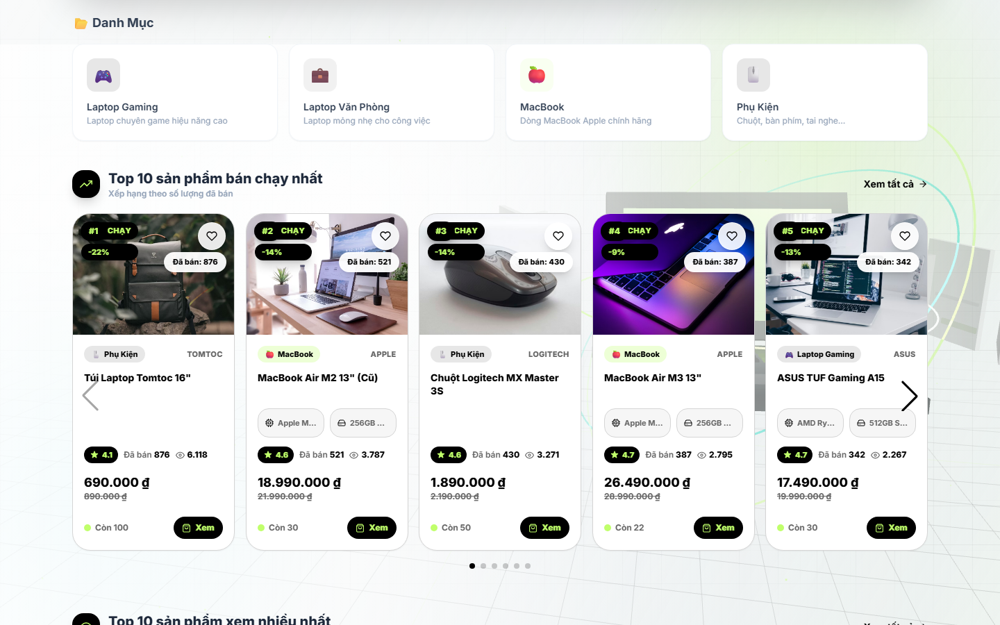
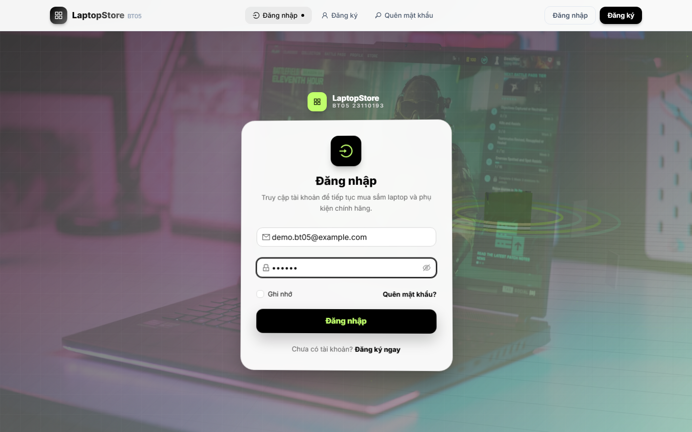
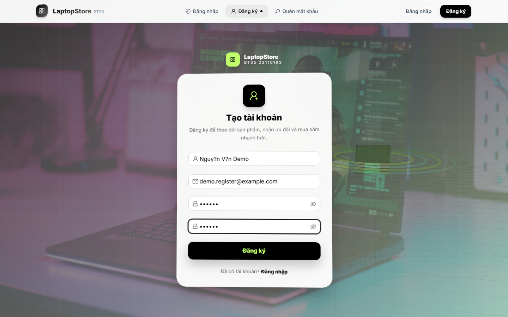
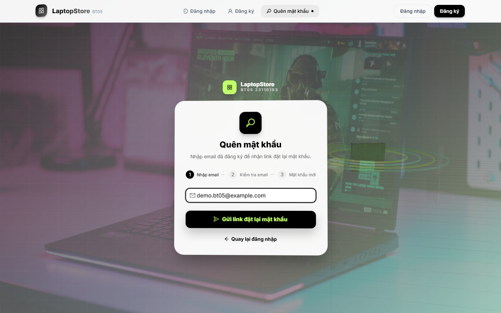
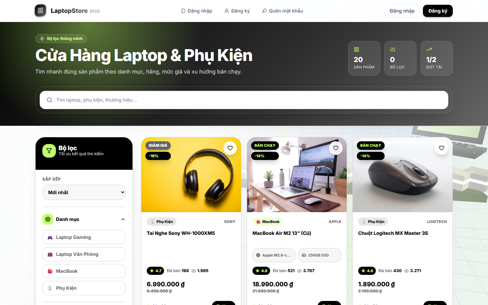
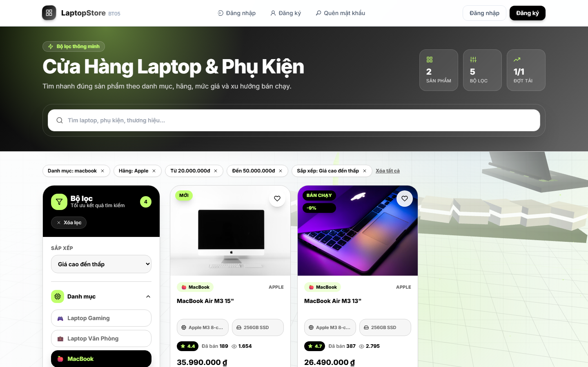
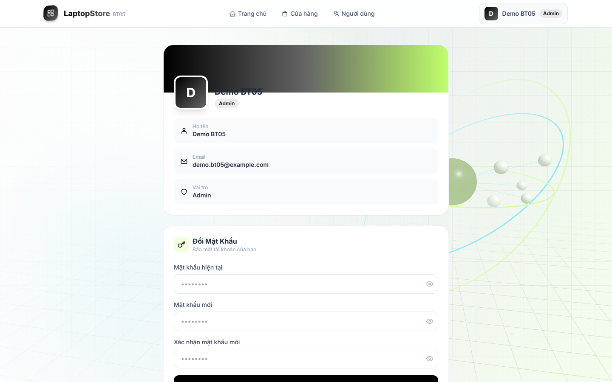
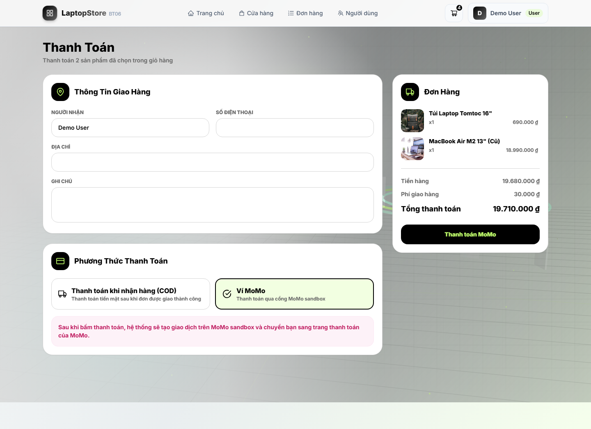

# BT06 - LaptopStore 3D E-Commerce

<div align="center">

**Bài tập cá nhân môn Các Công Nghệ Phần Mềm Mới**<br>
**Sinh viên:** Đinh Nguyễn Đức Duy - **MSSV:** 23110193


</div>

---

## Tổng Quan

BT06 là ứng dụng **LaptopStore** fullstack được phát triển tiếp từ BT05, gồm frontend React/Vite và backend Express/MongoDB. Bài làm bổ sung giỏ hàng lưu bằng database, thanh toán COD và MoMo sandbox, chọn riêng sản phẩm trong giỏ để thanh toán, lịch sử mua hàng, theo dõi trạng thái đơn hàng và dashboard admin quản lý đơn/doanh thu/tồn kho.

Giao diện sử dụng chủ đề laptop/công nghệ với màu đen, xám, trắng và accent xanh `#C0FF6B`. Các trang auth, trang chủ, shop, chi tiết sản phẩm và profile đều có nền 3D chung nhưng được bố trí để không che nội dung chính.

---

## Demo Giao Diện

Ảnh demo được chụp từ môi trường local với frontend `http://localhost:5173` và backend `http://localhost:8080`.

Nhóm ảnh BT05 được giữ lại cho các màn kế thừa như trang chủ, auth, shop, chi tiết sản phẩm và profile. Nhóm ảnh BT06 được chụp bổ sung cho giỏ hàng, checkout COD/MoMo, cổng MoMo sandbox, lịch sử đơn hàng, chi tiết theo dõi đơn và dashboard admin.

### Màn Hình Kế Thừa Từ BT05

| Trang chủ | Đăng nhập |
|---|---|
|  |  |

| Đăng ký | Quên mật khẩu |
|---|---|
|  |  |

| Shop | Shop có bộ lọc |
|---|---|
|  |  |

| Chi tiết sản phẩm | Profile |
|---|---|
|  |  |

### Màn Hình Bổ Sung Cho BT06

| Giỏ hàng chọn sản phẩm | Thanh toán COD |
|---|---|
|  |  |

| Thanh toán MoMo | Quét mã QR MoMo sandbox |
|---|---|
|  |  |

| Lịch sử đơn hàng | Theo dõi chi tiết một đơn |
|---|---|
|  |  |

| Dashboard admin |
|---|
|  |

Danh sách file ảnh nằm trong `docs/demo/`:

- `home.png`: trang chủ, khu vực top sản phẩm có mũi tên điều hướng trái/phải.
- `login.png`: trang đăng nhập.
- `register.png`: trang đăng ký.
- `forgot-password.png`: trang quên mật khẩu.
- `shop.png`: trang shop danh sách sản phẩm.
- `shop-filter.png`: trang shop khi bật bộ lọc.
- `product-detail.png`: trang chi tiết sản phẩm.
- `profile.png`: trang profile người dùng.
- `bt06-cart.png`: giỏ hàng, chọn riêng từng sản phẩm hoặc nhóm sản phẩm để thanh toán.
- `bt06-checkout-cod.png`: màn checkout với phương thức COD.
- `bt06-checkout-momo.png`: màn checkout với phương thức MoMo sandbox.
- `bt06-momo-qr.png`: màn cổng thanh toán MoMo sandbox có QR code.
- `bt06-orders.png`: lịch sử mua hàng của người dùng.
- `bt06-order-detail.png`: theo dõi chi tiết một đơn hàng.
- `bt06-admin-dashboard.png`: dashboard admin quản lý đơn hàng, tiền và tồn kho.

---

## Chức Năng BT06

### 1. Giỏ hàng

- API giỏ hàng yêu cầu đăng nhập và lưu dữ liệu trong MongoDB qua model `Cart`.
- UI `/cart` cho phép xem giỏ hàng, chọn từng sản phẩm hoặc chọn theo nhóm để thanh toán, tăng/giảm số lượng, xóa từng sản phẩm hoặc xóa toàn bộ giỏ hàng.
- Trang chi tiết sản phẩm gọi API thật để thêm sản phẩm vào giỏ hàng và đồng bộ số lượng trên header.

API:

```http
GET /v1/api/cart
POST /v1/api/cart/items
PUT /v1/api/cart/items/:productId
DELETE /v1/api/cart/items/:productId
DELETE /v1/api/cart
```

### 2. Thanh toán COD và MoMo sandbox

- UI `/checkout` nhận thông tin người nhận, địa chỉ, số điện thoại và ghi chú.
- API `POST /v1/api/checkout` tạo đơn hàng từ các sản phẩm đã chọn, snapshot sản phẩm, trừ tồn kho và chỉ xóa các sản phẩm đã thanh toán khỏi giỏ hàng.
- Hệ thống chỉ hỗ trợ 2 phương thức: `COD` và `MOMO`.
- Với `MOMO`, API gọi MoMo sandbox `/v2/gateway/api/create` để lấy `payUrl`; đơn giữ trạng thái `PENDING` cho tới khi MoMo trả kết quả qua redirect/IPN hoặc người dùng bấm kiểm tra thanh toán.
- Nếu người dùng mở trang MoMo rồi thoát/không thanh toán, đơn MoMo `PENDING` sẽ hết hạn sau `MOMO_PAYMENT_EXPIRE_MINUTES` phút. Khi hết hạn, API kiểm tra MoMo một lần; nếu vẫn chưa thành công thì tự chuyển đơn sang `CANCELLED/FAILED`, hoàn kho và đưa sản phẩm đã chọn về lại giỏ hàng.
- Với `COD`, trạng thái thanh toán là `UNPAID` tới khi admin cập nhật đơn `DELIVERED`, lúc đó API mới chuyển sang `PAID`.
- MoMo sandbox chỉ nhận đơn từ `1.000` đến `50.000.000` VND theo tài liệu MoMo.

### 3. Theo dõi đơn hàng

- UI `/orders` hiển thị lịch sử mua hàng; `/orders/:id` hiển thị chi tiết đơn, sản phẩm, thanh toán, địa chỉ giao hàng và dòng trạng thái.
- Trạng thái đơn hàng gồm: đơn hàng mới, đã xác nhận, shop đang chuẩn bị hàng, đang giao hàng, đã giao thành công, hủy đơn hàng, gửi yêu cầu hủy đơn.
- Đơn hàng mới được hệ thống tự động xác nhận sau 30 phút khi người dùng mở lịch sử/chi tiết đơn.
- Người dùng được hủy trực tiếp trong 30 phút đầu nếu đơn chưa thu tiền. Nếu đơn đã thanh toán MoMo hoặc shop đang chuẩn bị hàng thì chỉ gửi yêu cầu hủy để admin duyệt.
- Khi admin duyệt hủy đơn MoMo đã thu tiền, API gọi MoMo sandbox `/v2/gateway/api/refund` trước. Nếu hoàn tiền thất bại, đơn chưa được chuyển sang đã hủy và trạng thái tiền là `REFUND_PENDING`.

### 4. Dashboard admin

- UI `/admin` dành riêng cho tài khoản admin, không dùng màn lịch sử đơn hàng của khách.
- Admin xem tổng đơn, tiền đã thu, COD chờ thu, MoMo chờ thanh toán, tiền chờ hoàn, tiền đã hoàn, giá trị tồn kho, số yêu cầu hủy và sản phẩm sắp hết hàng.
- Admin lọc/tìm đơn hàng, cập nhật trạng thái đơn, duyệt hoặc từ chối yêu cầu hủy đơn.

API:

```http
POST /v1/api/checkout
POST /v1/api/momo/return
POST /v1/api/momo/ipn
GET /v1/api/orders
GET /v1/api/orders/:id
POST /v1/api/orders/:id/sync-momo
POST /v1/api/orders/:id/cancel
PUT /v1/api/orders/:id/status
GET /v1/api/admin/dashboard
GET /v1/api/admin/orders
```

---

## Chức Năng Kế Thừa Từ BT05

### 1. Hiển thị sản phẩm theo danh mục với lazy loading

- API `GET /v1/api/products` hỗ trợ `category`, `brand`, `tag`, `minPrice`, `maxPrice`, `sort`, `search`, `page`, `limit`.
- UI trang shop dùng `IntersectionObserver` để tự động gọi API tải tiếp sản phẩm khi kéo xuống cuối trang.
- Khi chọn danh mục ở trang chủ hoặc sidebar shop, URL được đồng bộ dạng `/shop?category=macbook`.
- Bộ lọc có thể kết hợp danh mục, hãng, loại sản phẩm, khoảng giá và sắp xếp.
- Trạng thái lọc được hiển thị bằng chip để người dùng xóa từng điều kiện hoặc xóa toàn bộ.

Ví dụ API:

```http
GET /v1/api/products?category=macbook&brand=Apple&minPrice=20000000&maxPrice=50000000&sort=price_desc&page=1&limit=12
```

### 2. Top 10 bán chạy và top 10 xem nhiều

- API `GET /v1/api/products/top` trả danh sách xếp hạng sản phẩm.
- `type=best-selling` sắp xếp theo số lượng đã bán.
- `type=most-viewed` sắp xếp theo lượt xem chi tiết sản phẩm.
- API hỗ trợ `page` và `limit`, mặc định lấy 10 sản phẩm.
- UI trang chủ hiển thị hai carousel ngang bằng Swiper, có nút mũi tên trái/phải và pagination theo chiều ngang.
- Khi người dùng mở chi tiết sản phẩm, backend tự tăng `viewCount` để phục vụ bảng xếp hạng xem nhiều.

Ví dụ API:

```http
GET /v1/api/products/top?type=best-selling&page=1&limit=10
GET /v1/api/products/top?type=most-viewed&page=1&limit=10
```

---

## Các Trang Chính

| Trang | URL | Chức năng |
|---|---|---|
| Trang chủ | `http://localhost:5173/` | Hero, danh mục, top 10 bán chạy, top 10 xem nhiều, các section sản phẩm |
| Đăng nhập | `http://localhost:5173/login` | Đăng nhập JWT, ghi nhớ token |
| Đăng ký | `http://localhost:5173/register` | Tạo tài khoản và gửi email xác nhận |
| Quên mật khẩu | `http://localhost:5173/forgot-password` | Gửi link đặt lại mật khẩu |
| Shop | `http://localhost:5173/shop` | Search, filter, sort, lazy loading sản phẩm |
| Chi tiết sản phẩm | `http://localhost:5173/product/:id` | Ảnh, thông số, giá, tồn kho, sản phẩm tương tự |
| Giỏ hàng | `http://localhost:5173/cart` | Chọn từng sản phẩm/nhóm sản phẩm để thanh toán |
| Thanh toán | `http://localhost:5173/checkout` | Thanh toán COD hoặc tạo giao dịch MoMo sandbox |
| Lịch sử đơn | `http://localhost:5173/orders` | Theo dõi lịch sử mua hàng và trạng thái đơn |
| MoMo return | `http://localhost:5173/payment/momo-return` | Nhận kết quả redirect từ MoMo sandbox |
| Profile | `http://localhost:5173/profile` | Thông tin tài khoản và đổi mật khẩu |
| Quản lý user | `http://localhost:5173/user` | Danh sách, sửa, xóa user |
| Admin shop | `http://localhost:5173/admin` | Quản lý đơn hàng, trạng thái, tiền và tồn kho |

---

## Chức Năng Chính

### Auth

- Đăng ký tài khoản, mã hóa mật khẩu bằng `bcrypt`.
- Gửi email xác nhận tài khoản bằng Nodemailer.
- Đăng nhập bằng JWT và lưu token ở `localStorage`.
- Quên mật khẩu, gửi link reset qua email.
- Đặt lại mật khẩu bằng token.
- Lấy thông tin tài khoản từ JWT qua endpoint `/v1/api/account`.

### Sản Phẩm

- Trang chủ có hero, danh mục nhanh và các carousel sản phẩm.
- Trang shop có search debounce, filter theo danh mục/tag/hãng/khoảng giá và sort.
- Lazy loading tự tải thêm sản phẩm khi kéo xuống cuối trang.
- Card sản phẩm đồng bộ kích thước, xử lý giá dài và hiển thị badge, rating, số đã bán, trạng thái tồn kho.
- Trang chi tiết có gallery ảnh, thông số, số lượng, tồn kho, sản phẩm tương tự và tự tăng lượt xem.

### Giao Diện 3D

- Component `TechScene3D.jsx` dùng Three.js để tạo nền laptop/công nghệ.
- Hiệu ứng được điều chỉnh theo từng nhóm trang để phù hợp ngữ cảnh.
- Lớp nền và độ mờ được tinh chỉnh để nội dung, form và card sản phẩm vẫn dễ đọc.

---

## Tech Stack

| Layer | Công nghệ |
|---|---|
| Frontend | React, Vite, React Router, TailwindCSS, Ant Design |
| UI/Media | Three.js, Swiper, react-icons, ảnh sản phẩm từ URL ngoài |
| Backend | Node.js, Express.js |
| Database | MongoDB, Mongoose |
| Auth | JWT, bcrypt |
| Email | Nodemailer SMTP |

---

## Cấu Trúc Project

```text
BT06_23110193_DinhNguyenDucDuy/
├── ExpressJS01/
│   ├── src/
│   │   ├── config/              # Database, view engine
│   │   ├── controllers/         # Controller auth/user/product
│   │   ├── data/                # Bộ ảnh sản phẩm demo
│   │   ├── middleware/          # JWT middleware
│   │   ├── models/              # User, Product, Category
│   │   ├── routes/api.js        # Toàn bộ API route
│   │   ├── scripts/seed.js      # Seed dữ liệu laptop/phụ kiện
│   │   ├── services/            # Business logic
│   │   └── server.js
│   └── package.json
├── ReactJS01/
│   ├── src/
│   │   ├── components/
│   │   │   ├── auth/            # Layout auth dùng chung
│   │   │   ├── home/            # Hero, product section, top carousel
│   │   │   ├── layout/          # Header, TechScene3D
│   │   │   ├── product/         # Chi tiết sản phẩm
│   │   │   └── shop/            # Filter, grid, product card
│   │   ├── pages/               # login, register, shop, home...
│   │   ├── styles/global.css
│   │   └── util/                # Axios API, debounce
│   └── package.json
└── docs/demo/                   # Ảnh demo dùng trong README
```

---

## API Chính

### Auth/User

| Method | Endpoint | Mô tả |
|---|---|---|
| `POST` | `/v1/api/register` | Đăng ký và gửi email xác nhận |
| `POST` | `/v1/api/login` | Đăng nhập |
| `GET` | `/v1/api/account` | Lấy thông tin tài khoản từ JWT |
| `GET` | `/v1/api/verify-email/:token` | Xác nhận email |
| `POST` | `/v1/api/resend-verification` | Gửi lại email xác nhận |
| `POST` | `/v1/api/forgot-password` | Gửi link quên mật khẩu |
| `POST` | `/v1/api/reset-password/:token` | Đặt lại mật khẩu |
| `GET` | `/v1/api/user` | Danh sách user |
| `PUT` | `/v1/api/user/:id` | Cập nhật user |
| `DELETE` | `/v1/api/user/:id` | Xóa user |
| `PUT` | `/v1/api/account/change-password` | Đổi mật khẩu |

### Product/Category

| Method | Endpoint | Mô tả |
|---|---|---|
| `GET` | `/v1/api/products` | Search/filter/sort/pagination, dùng cho lazy loading shop |
| `GET` | `/v1/api/products/home` | Dữ liệu các section trang chủ |
| `GET` | `/v1/api/products/top` | Top bán chạy hoặc xem nhiều, hỗ trợ `type`, `page`, `limit` |
| `GET` | `/v1/api/products/:id` | Chi tiết sản phẩm, tự tăng `viewCount` |
| `GET` | `/v1/api/products/similar/:id` | Sản phẩm tương tự |
| `GET` | `/v1/api/categories` | Danh mục |
| `POST` | `/v1/api/products` | Tạo sản phẩm |
| `PUT` | `/v1/api/products/:id` | Cập nhật sản phẩm |
| `DELETE` | `/v1/api/products/:id` | Xóa mềm sản phẩm |

---

## Cách Chạy Local

### 1. Backend

```bash
cd BT06_23110193_DinhNguyenDucDuy/ExpressJS01
npm install
npm run seed
npm run dev
```

Seed tạo sẵn 2 tài khoản đã xác thực:

```text
User:  demo@bt06.local  / 123456
Admin: admin@bt06.local / 123456
```

Backend chạy tại:

```text
http://localhost:8080
```

### 2. Frontend

```bash
cd BT06_23110193_DinhNguyenDucDuy/ReactJS01
npm install
npm run dev
```

Frontend chạy tại:

```text
http://localhost:5173
```

---

## Cấu Hình Môi Trường

Tạo file `ExpressJS01/.env`:

```env
PORT=8080
MONGO_DB_URL=mongodb://127.0.0.1:27017/bt06
JWT_SECRET=your_jwt_secret
JWT_EXPIRE=1d
FRONTEND_URL=http://localhost:5173
BACKEND_PUBLIC_URL=http://localhost:8080

MOMO_ENDPOINT=https://test-payment.momo.vn
MOMO_PARTNER_CODE=MOMO
MOMO_ACCESS_KEY=F8BBA842ECF85
MOMO_SECRET_KEY=K951B6PE1waDMi640xX08PD3vg6EkVlz
MOMO_REDIRECT_URL=http://localhost:5173/payment/momo-return
MOMO_IPN_URL=http://localhost:8080/v1/api/momo/ipn
MOMO_PAYMENT_EXPIRE_MINUTES=15
MOMO_SWEEP_INTERVAL_MINUTES=5
MOMO_SWEEP_ENABLED=true

EMAIL_HOST=smtp.gmail.com
EMAIL_PORT=587
EMAIL_SECURE=false
EMAIL_USER=your_email@gmail.com
EMAIL_PASS=your_app_password
EMAIL_FROM="LaptopStore BT06 <your_email@gmail.com>"
```

Frontend dùng `ReactJS01/.env.development`:

```env
VITE_BACKEND_URL=http://localhost:8080
```

Ghi chú MoMo: `MOMO_IPN_URL` dùng `localhost` chỉ phù hợp chạy local và MoMo không gọi được IPN từ Internet. Khi cần kiểm thử IPN thật, đổi `BACKEND_PUBLIC_URL`/`MOMO_IPN_URL` sang URL public như ngrok hoặc domain deploy.

---

## Kiểm Tra Nhanh

```bash
# Kiểm tra frontend build
cd BT06_23110193_DinhNguyenDucDuy/ReactJS01
npm run build

# Kiểm tra cú pháp backend service/server
cd ../ExpressJS01
node --check src/services/orderService.js
node --check src/services/momoService.js
node --check src/controllers/orderController.js
node --check src/routes/api.js
```

Các case đã kiểm tra:

- Shop tải sản phẩm theo `page` và `limit`, tự load thêm khi kéo xuống cuối trang.
- Lọc theo danh mục, hãng, khoảng giá, tag và sort hoạt động trên cùng URL query.
- API top 10 bán chạy trả dữ liệu theo `sold`.
- API top 10 xem nhiều trả dữ liệu theo `viewCount`.
- Mở chi tiết sản phẩm tự tăng lượt xem.
- Checkout MoMo sandbox tạo được `payUrl`, trạng thái đơn là `PENDING`, không đánh dấu `PAID` khi chưa có kết quả MoMo.
- Nút kiểm tra MoMo gọi `/v1/api/orders/:id/sync-momo`; nếu MoMo còn chờ người dùng xác nhận thì đơn vẫn giữ `PENDING`.
- Đơn MoMo quá hạn tự chuyển `CANCELLED/FAILED`, hoàn kho và đưa sản phẩm về lại giỏ hàng.
- Hủy đơn MoMo chưa thanh toán chuyển `CANCELLED/FAILED` và hoàn kho.
- Checkout COD tạo đơn `UNPAID`; hủy trực tiếp trong 30 phút giữ `UNPAID` và hoàn kho.
- Các ảnh README đã được cập nhật đủ cho trang chủ, đăng nhập, đăng ký, quên mật khẩu, shop, bộ lọc, chi tiết sản phẩm và profile.

---

## Ghi Chú

- Cần MongoDB local đang chạy trước khi seed hoặc chạy backend.
- Email xác nhận/quên mật khẩu cần SMTP hợp lệ. Nếu dùng Gmail, cần App Password.
- Ảnh sản phẩm demo được gắn theo tên sản phẩm trong `ExpressJS01/src/data/productImages.js`.
