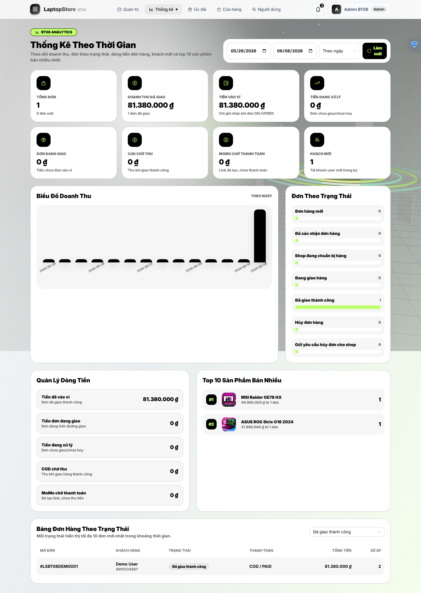
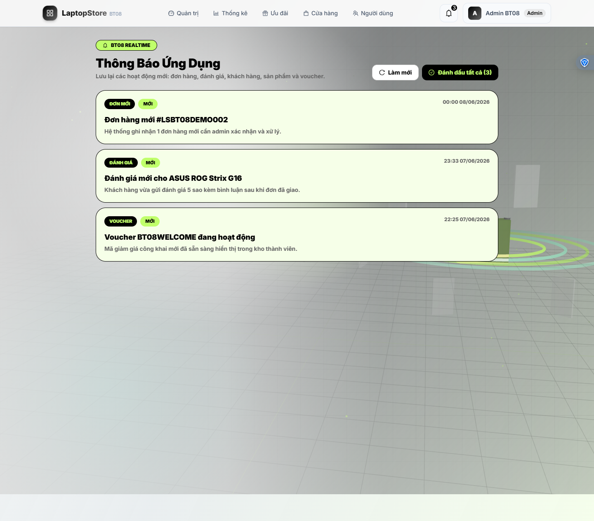
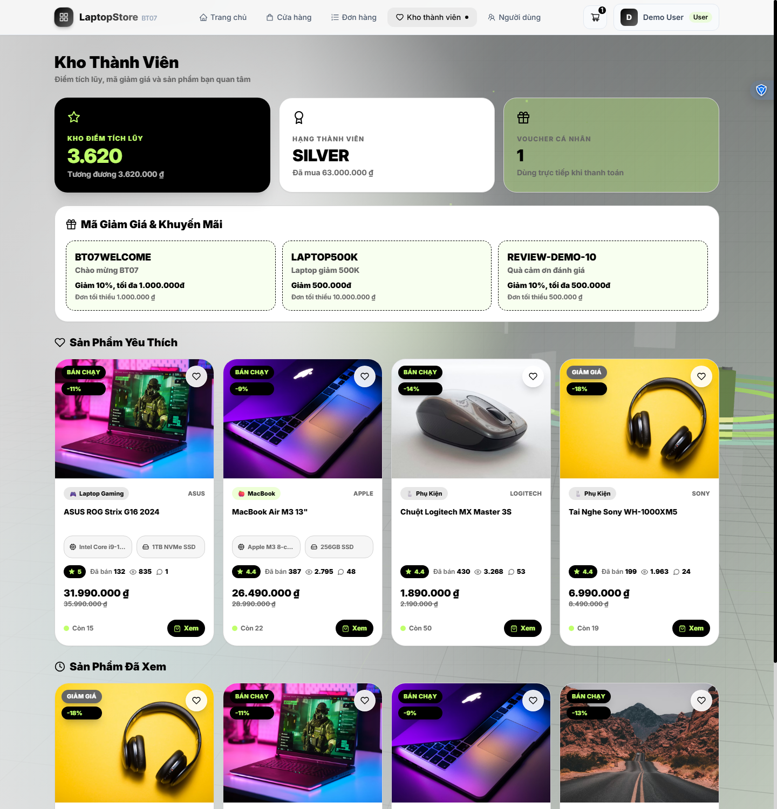
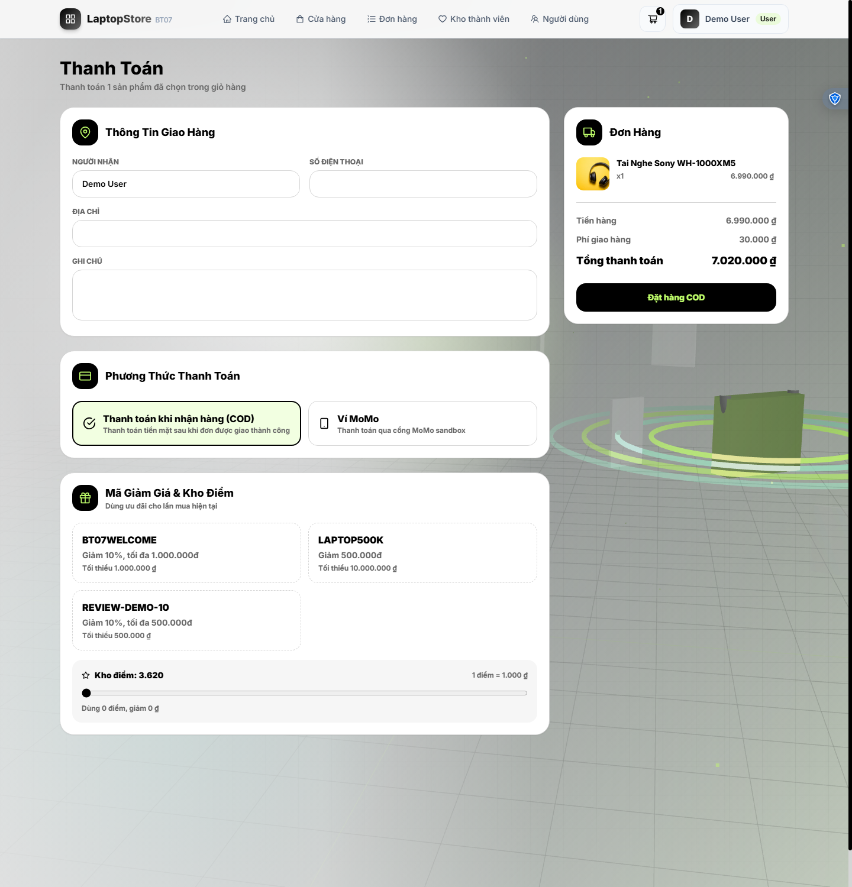
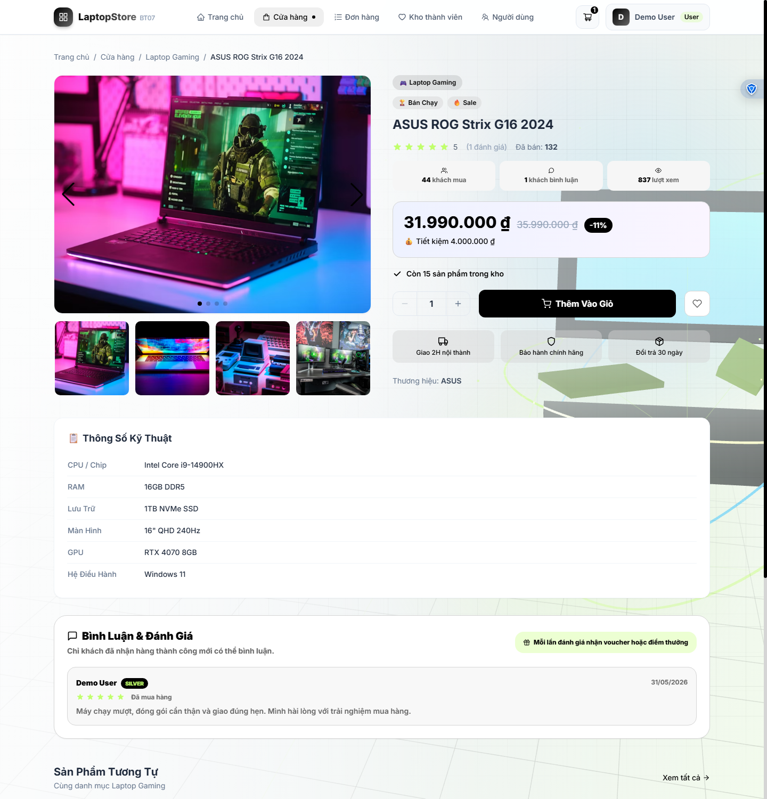
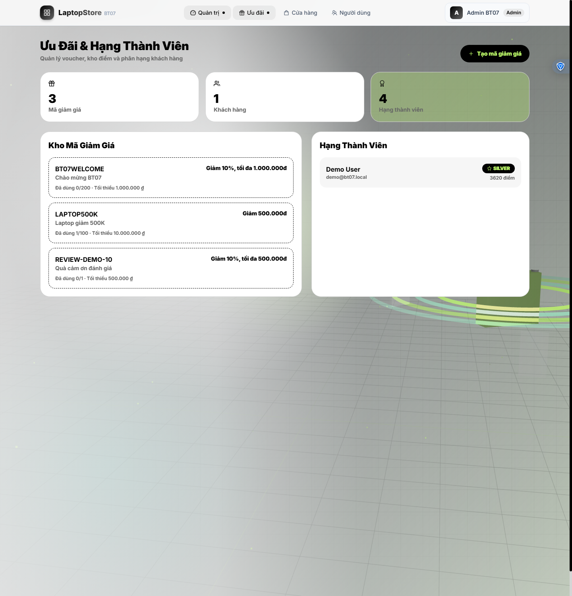

# BT08 - LaptopStore Realtime Notification & Analytics

<div align="center">

**Bài tập cá nhân môn Các Công Nghệ Phần Mềm Mới**  
**Sinh viên:** Đinh Nguyễn Đức Duy - **MSSV:** 23110193


</div>

## Tổng Quan

BT08 được phát triển từ BT07 LaptopStore Loyalty E-Commerce. Bài làm bổ sung hai nhóm chức năng chính:

- Realtime notification bằng WebSocket, lưu thông báo vào MongoDB, hiển thị trên UI và gửi email qua Nodemailer.
- Thống kê theo thời gian bằng bảng và biểu đồ cho doanh thu, dòng tiền đơn hàng, đơn theo trạng thái, khách hàng mới và top 10 sản phẩm bán nhiều nhất.

Database demo của BT08 dùng `bt08`, tách riêng với BT07.

## Chức Năng Mới BT08

### 1. Realtime Notification + Mail

Backend có model `Notification`, Socket.IO server và service notification tập trung. Các hoạt động mới được ghi vào database, emit realtime và gửi email nếu cấu hình SMTP hợp lệ.

Các event đã gắn vào hệ thống:

- Khách đặt đơn mới: admin nhận notification và email.
- Khách gửi yêu cầu hủy đơn: admin nhận notification và email.
- Admin cập nhật trạng thái đơn: khách hàng nhận notification và email.
- Khách tạo review/bình luận sản phẩm: admin nhận notification và email.
- Khách hàng mới đăng ký: admin nhận notification và email.
- Admin tạo sản phẩm mới hoặc voucher mới: notification được phát realtime.

UI đã bổ sung:

- Chuông thông báo trên header, hiển thị badge số thông báo chưa đọc.
- Dropdown realtime nhận event `notification:new` từ Socket.IO.
- Trang `/notifications` hiển thị danh sách notification, đánh dấu đã đọc từng notification hoặc tất cả.
- Dashboard admin tự refresh khi có event `analytics:refresh`.

API:

```http
GET /v1/api/notifications?limit=8&page=1&unread=true
PUT /v1/api/notifications/:id/read
PUT /v1/api/notifications/read-all
```

Socket events:

```text
notification:new
analytics:refresh
socket:ready
```

Ghi chú mail:

- Mail dùng biến môi trường SMTP sẵn có: `EMAIL_HOST`, `EMAIL_PORT`, `EMAIL_USER`, `EMAIL_PASS`, `EMAIL_FROM`.
- Có thể tắt mail notification bằng `NOTIFICATION_MAIL_ENABLED=false`.
- Có thể chỉ định email admin bằng `NOTIFICATION_ADMIN_EMAILS=admin1@example.com,admin2@example.com`.
- Lỗi gửi mail được log nhưng không làm fail API đặt đơn hoặc cập nhật đơn.

### 2. Thống Kê Theo Thời Gian

Trang admin mới: `/admin/statistics`.

Nội dung thống kê:

- Lọc theo `startDate`, `endDate`, `groupBy=day|month`.
- Card tổng hợp: tổng đơn, doanh thu đơn đã giao, tiền vào ví, tiền đang xử lý, đơn đang giao, COD chờ thu, MoMo chờ thanh toán, khách mới.
- Biểu đồ doanh thu theo ngày/tháng.
- Biểu đồ số đơn theo từng trạng thái.
- Bảng quản lý dòng tiền: tiền đã vào ví, tiền đơn đang giao, tiền đang xử lý, COD chờ thu, MoMo chờ thanh toán.
- Top 10 sản phẩm bán nhiều nhất theo số lượng và doanh thu.
- Bảng danh sách đơn theo trạng thái, mỗi trạng thái hiển thị tối đa 10 đơn mới nhất.

API:

```http
GET /v1/api/admin/statistics?startDate=2026-05-26&endDate=2026-06-08&groupBy=day
```

Response gồm các nhóm dữ liệu chính:

```text
summary
series
statusStats
ordersByStatus
topProducts
newCustomers
cashFlow
labels
```

## Demo Màn Hình

Ảnh BT08 mới được chụp từ frontend `http://127.0.0.1:5173` và backend `http://127.0.0.1:8080` sau khi chạy seed BT08.

| BT08 - Admin thống kê theo thời gian, doanh thu, dòng tiền, top sản phẩm và bảng đơn theo trạng thái |
|---|
|  |

| BT08 - Trang notification realtime |
|---|
|  |

Các ảnh màn hình kế thừa từ BT07 vẫn nằm trong `docs/demo` và được giữ lại trong BT08:

| Kho điểm, voucher, yêu thích và sản phẩm đã xem |
|---|
|  |

| Checkout áp mã giảm giá và đổi điểm |
|---|
|  |

| Bình luận của khách đã mua thành công |
|---|
|  |

| Admin quản lý mã giảm giá và hạng thành viên |
|---|
|  |

| Admin xem sản phẩm và vị trí giao trước khi cập nhật đơn |
|---|
|  |

Các ảnh kế thừa từ BT06/BT07 khác cũng được giữ trong `docs/demo`: `home.png`, `shop.png`, `product-detail.png`, `bt06-cart.png`, `bt06-checkout-cod.png`, `bt06-checkout-momo.png`, `bt06-orders.png`, `bt06-order-detail.png`, `bt06-admin-dashboard.png`.

## Cấu Trúc Chính

```text
BT08_23110193_DinhNguyenDucDuy/
├── ExpressJS01/
│   └── src/
│       ├── controllers/
│       │   ├── notificationController.js
│       │   └── statisticsController.js
│       ├── models/
│       │   └── notification.js
│       ├── routes/api.js
│       ├── services/
│       │   ├── notificationService.js
│       │   ├── socketService.js
│       │   ├── mailService.js
│       │   └── statisticsService.js
│       └── server.js
├── ReactJS01/
│   └── src/
│       ├── pages/admin-statistics.jsx
│       ├── pages/notifications.jsx
│       ├── util/socket.js
│       ├── util/api.js
│       └── components/layout/header.jsx
└── docs/demo/
    ├── bt08-admin-statistics.png
    ├── bt08-notifications.png
    └── các ảnh BT07/BT06 kế thừa
```

## Cách Chạy

Yêu cầu: Node.js, npm và MongoDB local.

```bash
# Terminal 1 - Backend
cd BT08_23110193_DinhNguyenDucDuy/ExpressJS01
npm install
npm run seed
npm run dev

# Terminal 2 - Frontend
cd BT08_23110193_DinhNguyenDucDuy/ReactJS01
npm install
npm run dev
```

Truy cập:

| Màn hình | URL |
|---|---|
| Trang chủ | `http://localhost:5173` |
| Kho thành viên | `http://localhost:5173/store` |
| Lịch sử đơn | `http://localhost:5173/orders` |
| Notification | `http://localhost:5173/notifications` |
| Dashboard admin | `http://localhost:5173/admin` |
| Admin thống kê | `http://localhost:5173/admin/statistics` |
| Admin ưu đãi | `http://localhost:5173/admin/loyalty` |

Tài khoản seed:

| Quyền | Email | Mật khẩu |
|---|---|---|
| User | `demo@bt08.local` | `123456` |
| Admin | `admin@bt08.local` | `123456` |

> `npm run seed` xóa dữ liệu cũ trong database `bt08` trước khi tạo lại dữ liệu demo.

## Kiểm Tra Đã Chạy

Đã kiểm tra trong môi trường local:

```bash
# Backend syntax
node --check src/server.js
node --check src/services/notificationService.js
node --check src/services/statisticsService.js
node --check src/services/orderService.js

# Frontend production build
cd ReactJS01
npm run build

# Seed demo
cd ExpressJS01
npm run seed
```

Kết quả:

- Frontend build thành công.
- Backend JS syntax check thành công.
- Seed BT08 thành công với 20 sản phẩm, 4 danh mục, 2 user, 3 voucher, 4 notification mẫu, 1 đơn delivered và 1 review.
- Service thống kê trả về `EC=0`, có doanh thu, status stats và top product.
- Service notification trả về EC=0, có unread/count đúng theo admin.
- Đã chụp lại hai ảnh BT08 đầu tiên sau khi sửa tiếng Việt có dấu: t08-admin-statistics.png và t08-notifications.png.

## Ghi Chú Kỹ Thuật

- Socket.IO được khởi tạo từ HTTP server trong `server.js`, không dùng `app.listen` trực tiếp.
- Socket auth lấy JWT từ `handshake.auth.token`, join room `user:<id>` và `role:<role>`.
- Notification được phân quyền theo `audience=admin|user|all` hoặc `recipient`.
- Thống kê doanh thu ghi nhận tiền vào ví khi đơn có status `DELIVERED`.
- Series thống kê dùng timezone `Asia/Bangkok` để ngày trên chart khớp với filter UI.
- `node_modules` và `dist` không được đưa vào folder nộp; chạy `npm install` để cài lại dependency.

