# 📚 CNPMM — Các Công Nghệ Phần Mềm Mới

<div align="center">

**Tổng hợp bài tập môn học — Công Nghệ Phần Mềm Mã Nguồn Mở**

| 👤 Sinh viên | 🎓 MSSV | 🏫 Lớp |
|:---:|:---:|:---:|
| **Đinh Nguyễn Đức Duy** | **23110193** | Nhóm 02 — Tiết 2-4 — Phòng A308 |

[](https://github.com/ShiroKin7448/CNPMM)


</div>

---

## 📂 Danh Sách Bài Tập

| # | Tên bài | Công nghệ chính | Link |
|:-:|---------|----------------|------|
| BT01 | Quản lý User — CRUD với EJS | Express.js · MongoDB · EJS · Bootstrap | [📁 Xem thư mục](./BT01_23110193_DinhNguyenDucDuy/) |
| BT02 | Edit Profile — Authentication & Authorization | Express.js · MongoDB · JWT · Nodemailer | [📁 Xem thư mục](./BT02_EditProfile_23110193_DinhNguyenDucDuy/) |
| BT03 | FullStack — Node.js + React.js | Express.js · MongoDB · React · Ant Design · JWT | [📁 Xem thư mục](./BT03_23110193_DinhNguyenDucDuy/) |
| BT03(NHOM) | Redux + Page Wiring — Dự án nhóm | React · Redux Toolkit · Axios · TailwindCSS | [📁 Xem thư mục](./BT03(NHOM)_Redux_Page_Wiring_23110193_DinhNguyenDucDuy/) |
| BT04 | **E-Commerce — LaptopStore FullStack** | React · Vite · TailwindCSS · Express · MongoDB · JWT · Nodemailer | [📁 Xem thư mục](./BT04_23110193_DinhNguyenDucDuy/) |
| BT04(Nhóm) | **Admin CMS + FAQ + Search + Forum persistence & moderation** | React · Redux Toolkit · TailwindCSS · Express · MongoDB · JWT | [📁 Xem thư mục](./BT04(Nhóm)-23110193_DinhNguyenDucDuy/) |
| BT05 | **LaptopStore 3D E-Commerce — Lazy Loading & Top Products** | React · Vite · Three.js · Swiper · Express · MongoDB · JWT | [📁 Xem thư mục](./BT05_23110193_DinhNguyenDucDuy/) |
| BT06 | **LaptopStore 3D E-Commerce — Cart, COD, MoMo Sandbox & Admin Orders** | React · Vite · Three.js · Express · MongoDB · MoMo Sandbox · JWT | [📁 Xem thư mục](./BT06_23110193_DinhNguyenDucDuy/) |
| BT07 | **LaptopStore Loyalty E-Commerce — Reviews, Favorites, Voucher & Points** | React · Vite · Three.js · Express · MongoDB · JWT | [📁 Xem thư mục](./BT07_23110193_DinhNguyenDucDuy/) |

---

## 📖 Chi Tiết Từng Bài

---

### 🟢 BT01 — Quản Lý Người Dùng CRUD

> **Thư mục:** [`BT01_23110193_DinhNguyenDucDuy/`](./BT01_23110193_DinhNguyenDucDuy/)

Xây dựng hệ thống quản lý người dùng cơ bản theo mô hình **MVC**, render giao diện phía server bằng EJS.

**Chức năng:**
- ✅ **Create** — Thêm mới người dùng
- ✅ **Read** — Hiển thị danh sách từ MongoDB
- ✅ **Update** — Cập nhật thông tin
- ✅ **Delete** — Xóa người dùng

**Tech Stack:**


**Cách chạy:**
```bash
cd BT01_23110193_DinhNguyenDucDuy
npm install
npm start
# Truy cập: http://localhost:8088/crud
```

---

### 🟡 BT02 — Edit Profile (Auth & Authorization)

> **Thư mục:** [`BT02_EditProfile_23110193_DinhNguyenDucDuy/`](./BT02_EditProfile_23110193_DinhNguyenDucDuy/)

Xây dựng hệ thống xác thực người dùng đầy đủ với bảo vệ route, refresh token và gửi email.

**Chức năng:**
- ✅ Đăng ký / Đăng nhập với JWT
- ✅ Cập nhật thông tin cá nhân (Edit Profile)
- ✅ Rate limiting chống brute-force (`express-rate-limit`)
- ✅ Validate input với `express-validator`
- ✅ Gửi email qua Nodemailer
- ✅ Mã hóa mật khẩu bằng `bcryptjs`

**Tech Stack:**


**Cách chạy:**
```bash
cd BT02_EditProfile_23110193_DinhNguyenDucDuy/EditProfile
npm install
# Cấu hình .env (PORT, MONGO_DB_URL, JWT_SECRET, EMAIL_*)
npm start
```

---

### 🔵 BT03 — FullStack Node.js + React.js

> **Thư mục:** [`BT03_23110193_DinhNguyenDucDuy/`](./BT03_23110193_DinhNguyenDucDuy/)
> **README chi tiết:** [📄 Xem tại đây](./BT03_23110193_DinhNguyenDucDuy/README.md)

Ứng dụng FullStack hoàn chỉnh với **REST API** (Express) và **SPA** (React + Ant Design), giao tiếp qua Axios với JWT Authentication.

**Chức năng:**
- ✅ Register / Login với JWT + bcrypt
- ✅ Danh sách User (bảng có search, filter, sort)
- ✅ Forgot Password → gửi email reset link (15 phút)
- ✅ Reset Password → đặt mật khẩu mới qua token
- ✅ Duy trì session khi F5 trang
- ✅ Dark theme hiện đại với glassmorphism

**Tech Stack:**


**Cách chạy:**
```bash
# Terminal 1 — Backend
cd BT03_23110193_DinhNguyenDucDuy/ExpressJS01
npm install
npm run dev        # http://localhost:8080

# Terminal 2 — Frontend
cd BT03_23110193_DinhNguyenDucDuy/ReactJS01
npm install
npm run dev        # http://localhost:5173
```

---

### 🟣 BT03(NHOM) — Redux + Page Wiring (Dự Án Nhóm)

> **Thư mục:** [`BT03(NHOM)_Redux_Page_Wiring_23110193_DinhNguyenDucDuy/`](./BT03(NHOM)_Redux_Page_Wiring_23110193_DinhNguyenDucDuy/)
> **README chi tiết:** [📄 Xem tại đây](./BT03(NHOM)_Redux_Page_Wiring_23110193_DinhNguyenDucDuy/README.md)

Phần đóng góp của Đinh Nguyễn Đức Duy trong dự án nhóm **hcmute-student-consulting** — hệ thống tư vấn sinh viên HCMUTE. Đảm nhận vai trò quản lý **Redux state** và xây dựng **ProfilePage**.

**Chức năng:**
- ✅ Redux store với `@reduxjs/toolkit`
- ✅ `authSlice.js` — đầy đủ actions cho Register, Login, OTP, Forgot/Reset Password, Profile
- ✅ `hooks.js` — `useAuth()` hook kết nối Redux + Axios API
- ✅ `selectors.js` — selectors truy cập auth state
- ✅ `ProfilePage.jsx` — xem/chỉnh sửa hồ sơ, validation, logout

**Tech Stack:**


**Link repo nhóm:** [DangTranAnhQuan/hcmute-student-consulting](https://github.com/DangTranAnhQuan/hcmute-student-consulting) — nhánh `feature/edit-profile`

---

### 🛒 BT04 — E-Commerce LaptopStore FullStack

> **Thư mục:** [`BT04_23110193_DinhNguyenDucDuy/`](./BT04_23110193_DinhNguyenDucDuy/)
> **README chi tiết:** [📄 Xem tại đây](./BT04_23110193_DinhNguyenDucDuy/README.md)

Bài tập cá nhân **API + UI** — cửa hàng **Laptop & Phụ Kiện** fullstack với React/Vite, TailwindCSS, Express và MongoDB. Giao diện đã được đổi sang bộ màu `#000000`, `#656565`, `#D5D5D5`, `#C0FF6B`, có ảnh sản phẩm riêng và màn hình auth đặt giữa nền ảnh.

**Chức năng nổi bật:**
- ✅ **Auth đầy đủ** — đăng ký, đăng nhập, xác nhận email, gửi lại xác nhận, quên mật khẩu, đặt lại mật khẩu
- ✅ **Trang Shop** — search debounce, filter danh mục/tag/hãng/khoảng giá, sort, pagination, đồng bộ query string
- ✅ **Sản phẩm** — nhiều ảnh demo khác nhau, card có badge, giá sale, rating, tồn kho, sản phẩm tương tự
- ✅ **Chi tiết sản phẩm** — gallery ảnh, thumbnail, giá, tồn kho, số lượng, thông số kỹ thuật, sản phẩm tương tự
- ✅ **Bộ lọc sản phẩm** — lọc theo danh mục, loại, hãng, khoảng giá, sort, chip lọc đang bật và URL chia sẻ được
- ✅ **Trang chủ** — hero banner, danh mục và các section Giảm Giá / Bán Chạy / Mới Nhất / Nổi Bật
- ✅ **User/Profile** — quản lý user, sửa/xóa user, đổi mật khẩu
- ✅ **Backend API** — xử lý filter rỗng đúng, không còn lỗi `maxPrice=""` thành `0`, search escape regex an toàn hơn

**Demo nhanh:**

| Auth | Shop/filter | Chi tiết sản phẩm |
|---|---|---|
| 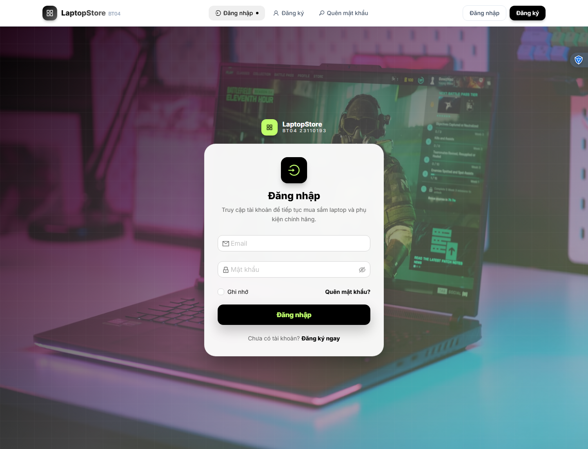 | 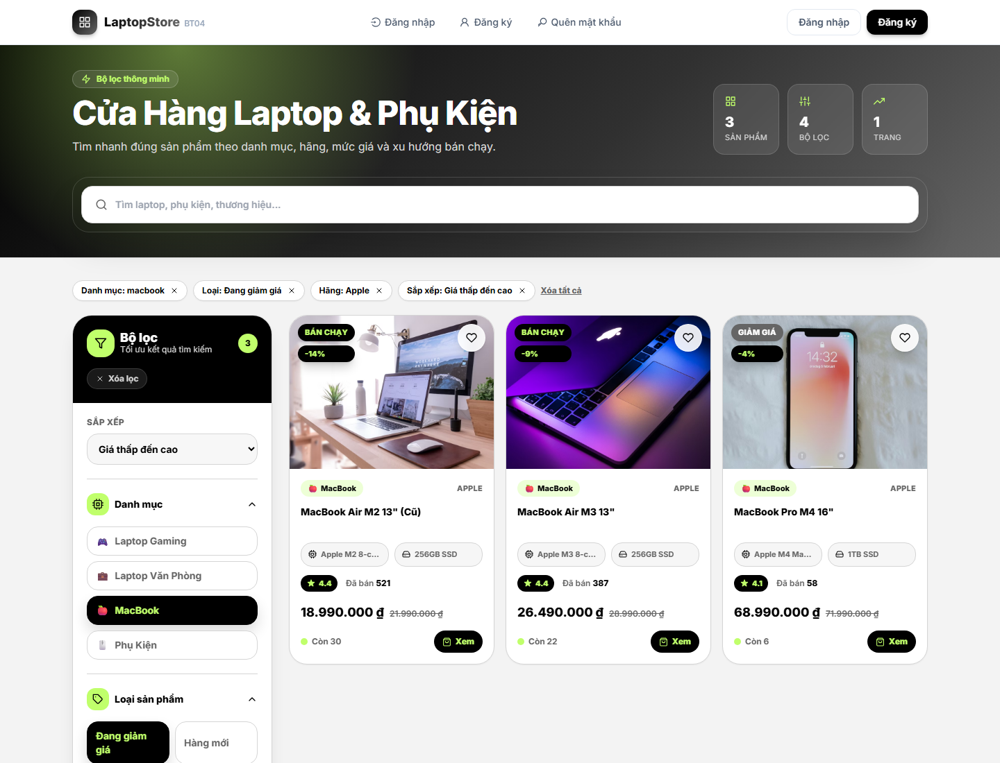 | 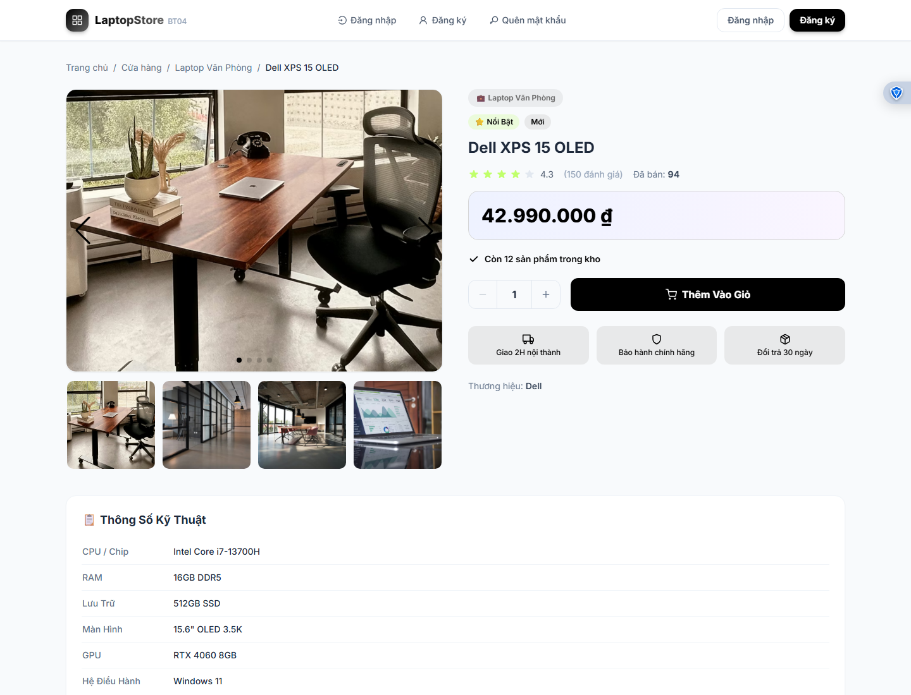 |

**Tech Stack:**


**Cách chạy:**
```bash
# Backend
cd BT04_23110193_DinhNguyenDucDuy/ExpressJS01
npm install
npm run seed   # Seed dữ liệu laptop/phụ kiện
npm run dev    # http://localhost:8080

# Frontend
cd ../ReactJS01
npm install
npm run dev    # http://localhost:5173
```

---

### BT04(Nhóm) — Admin CMS + FAQ + Search + Forum Persistence & Moderation

> **Thư mục:** [`BT04(Nhóm)-23110193_DinhNguyenDucDuy/`](./BT04(Nhóm)-23110193_DinhNguyenDucDuy/)
> **README chi tiết:** [📄 Xem tại đây](./BT04(Nhóm)-23110193_DinhNguyenDucDuy/README.md)

Phần bài nhóm trong dự án **HCMUTE Student Consulting**, được đưa lên repo cá nhân với nội dung phụ trách: **Admin CMS + FAQ + Search + Forum persistence & moderation**. Dự án gồm backend Express/MongoDB và frontend React/Redux.

**Chức năng nổi bật:**
- **Admin CMS** — quản lý bài viết và FAQ bằng API thật, bảo vệ bằng quyền admin
- **FAQ public** — hiển thị FAQ đã xuất bản, lọc theo danh mục và tìm kiếm nội dung
- **Search** — tìm kiếm tập trung trên bài viết, FAQ và forum, kèm bộ lọc theo topic, khoa, loại nội dung, độ phổ biến và thời gian
- **Forum persistence** — lưu chủ đề, trả lời, lượt vote và trạng thái giải quyết vào MongoDB
- **Moderation** — admin có thể ghim/bỏ ghim chủ đề, xóa chủ đề và xóa trả lời
- **Redux state** — tách state cho admin, FAQ, search và forum bằng Redux Toolkit

**Các trang demo:**

| Home | Admin CMS |
|---|---|
| -23110193_DinhNguyenDucDuy/docs/demo/home.png) | -23110193_DinhNguyenDucDuy/docs/demo/admin-cms.png) |

| FAQ | Search | Forum |
|---|---|---|
| -23110193_DinhNguyenDucDuy/docs/demo/faq.png) | -23110193_DinhNguyenDucDuy/docs/demo/search.png) | -23110193_DinhNguyenDucDuy/docs/demo/forum.png) |

| Trang | URL local |
|---|---|
| Admin CMS | `http://localhost:3001/admin/cms` |
| FAQ | `http://localhost:3001/faq` |
| Search | `http://localhost:3001/search` |
| Forum | `http://localhost:3001/forum` |

**Cách chạy:**
```bash
# Backend
cd BT04(Nhóm)-23110193_DinhNguyenDucDuy/backend
npm install
npm run dev    # http://localhost:3000

# Frontend
cd ../frontend
npm install
npm start      # http://localhost:3001
```

---

### 💻 BT05 — LaptopStore 3D E-Commerce

> **Thư mục:** [`BT05_23110193_DinhNguyenDucDuy/`](./BT05_23110193_DinhNguyenDucDuy/)
> **README chi tiết:** [📄 Xem tại đây](./BT05_23110193_DinhNguyenDucDuy/README.md)

Bài tập cá nhân phát triển tiếp từ BT04, bổ sung chức năng lazy loading sản phẩm theo danh mục và top 10 sản phẩm bán chạy/xem nhiều bằng carousel ngang. Giao diện được làm mới bằng nền 3D chủ đề laptop/công nghệ, có hiệu ứng riêng cho từng nhóm trang nhưng vẫn giữ logic thống nhất toàn website.

**Chức năng nổi bật:**
- ✅ **Shop lazy loading** — tự load thêm sản phẩm khi kéo xuống cuối trang bằng `IntersectionObserver`
- ✅ **API sản phẩm theo danh mục** — hỗ trợ `category`, `brand`, `tag`, `minPrice`, `maxPrice`, `sort`, `search`, `page`, `limit`
- ✅ **Top 10 bán chạy** — API `/v1/api/products/top?type=best-selling`, UI carousel ngang có mũi tên điều hướng
- ✅ **Top 10 xem nhiều** — API `/v1/api/products/top?type=most-viewed`, tự tăng `viewCount` khi mở chi tiết sản phẩm
- ✅ **Bộ lọc nâng cao** — filter theo danh mục, hãng, loại sản phẩm, khoảng giá, sort và đồng bộ query string
- ✅ **Trang chi tiết sản phẩm** — gallery ảnh, giá, tồn kho, thông số, sản phẩm tương tự
- ✅ **Auth/Profile** — đăng nhập, đăng ký, quên mật khẩu, xác nhận email, đổi mật khẩu
- ✅ **Giao diện 3D** — dùng Three.js, Swiper và hiệu ứng theo từng trang

**Demo nhanh:**

| Trang chủ/top sản phẩm | Shop/filter | Chi tiết sản phẩm | Profile |
|---|---|---|---|
|  |  | 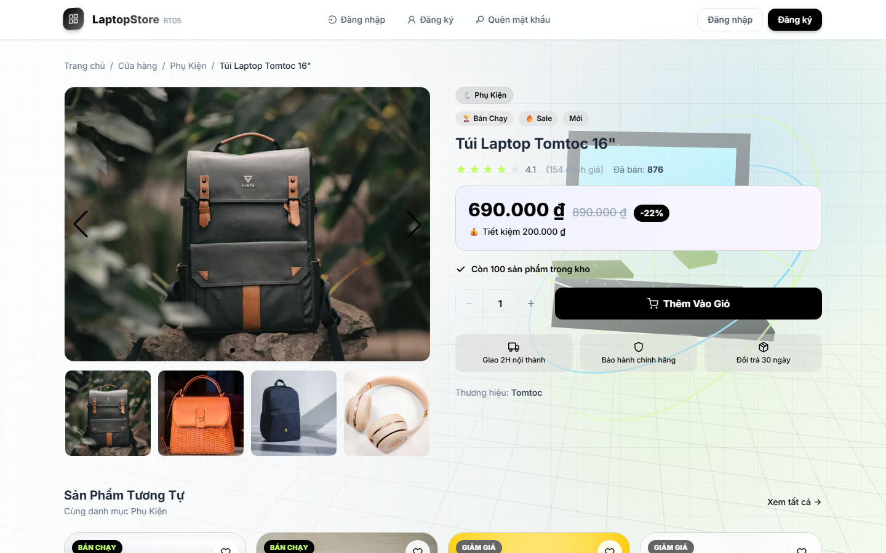 |  |

**Tech Stack:**


**Cách chạy:**
```bash
# Backend
cd BT05_23110193_DinhNguyenDucDuy/ExpressJS01
npm install
npm run seed
npm run dev    # http://localhost:8080

# Frontend
cd ../ReactJS01
npm install
npm run dev    # http://localhost:5173
```

---

### 💳 BT06 — LaptopStore 3D E-Commerce: Cart, Checkout & Orders

> **Thư mục:** [`BT06_23110193_DinhNguyenDucDuy/`](./BT06_23110193_DinhNguyenDucDuy/)
> **README chi tiết:** [📄 Xem tại đây](./BT06_23110193_DinhNguyenDucDuy/README.md)

Bài tập cá nhân phát triển tiếp từ BT05, bổ sung giỏ hàng lưu MongoDB, chọn riêng từng sản phẩm để thanh toán, checkout COD và MoMo sandbox, lịch sử đơn hàng, theo dõi trạng thái đơn, xử lý hủy đơn/hoàn kho/hoàn tiền và dashboard admin quản lý đơn hàng, tiền, tồn kho.

**Chức năng nổi bật:**
- ✅ **Giỏ hàng DB** — thêm/xóa/cập nhật số lượng, chọn từng sản phẩm hoặc nhóm sản phẩm để thanh toán
- ✅ **Checkout COD** — đơn COD chỉ chuyển `PAID` khi admin cập nhật đã giao thành công
- ✅ **MoMo sandbox thật** — tạo `payUrl`, màn quét QR, callback return/IPN, query trạng thái và refund
- ✅ **Hết hạn MoMo pending** — nếu người dùng thoát không thanh toán, đơn tự `CANCELLED/FAILED`, hoàn kho và đưa sản phẩm về lại giỏ
- ✅ **Theo dõi đơn hàng** — lịch sử mua hàng, timeline trạng thái, hủy trực tiếp/yêu cầu hủy theo nghiệp vụ
- ✅ **Dashboard admin** — quản lý trạng thái đơn, COD chờ thu, MoMo chờ thanh toán, chờ hoàn tiền, đã hoàn tiền và tồn kho

**Demo nhanh:**

| Giỏ hàng | Checkout COD | MoMo QR |
|---|---|---|
| 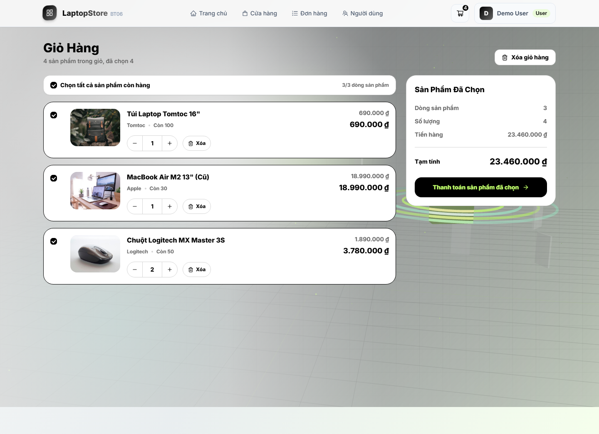 | 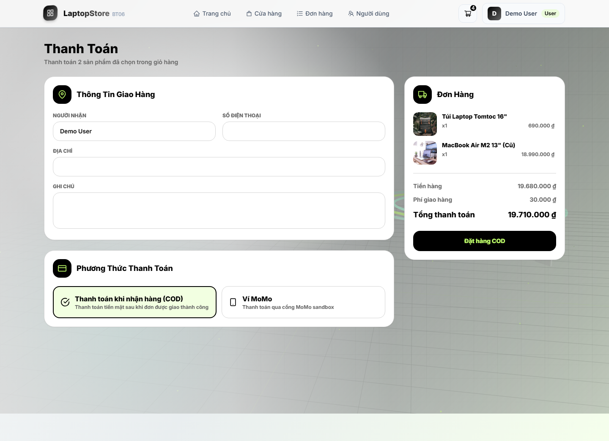 | 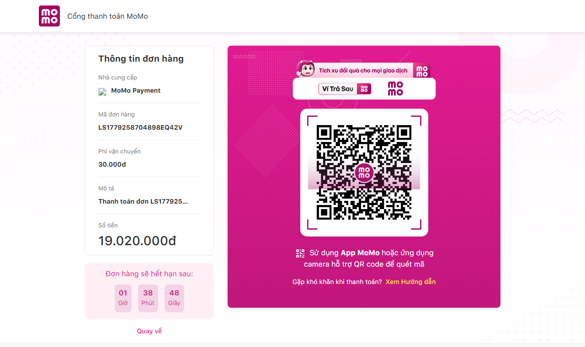 |

| Đơn hàng | Theo dõi đơn | Admin dashboard |
|---|---|---|
| 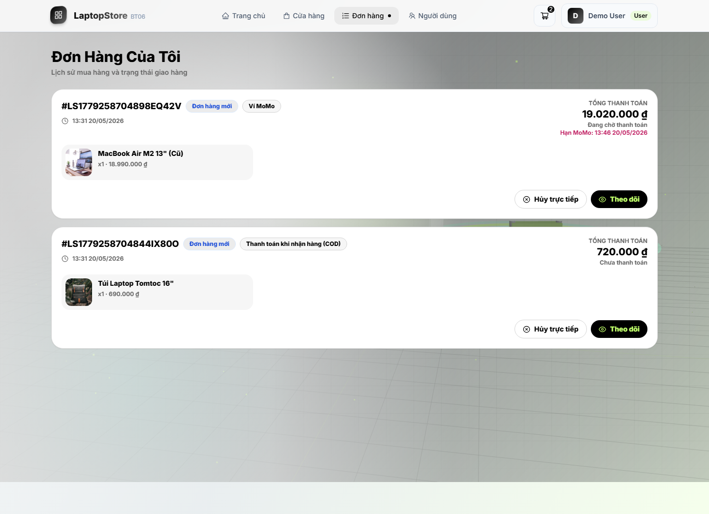 | 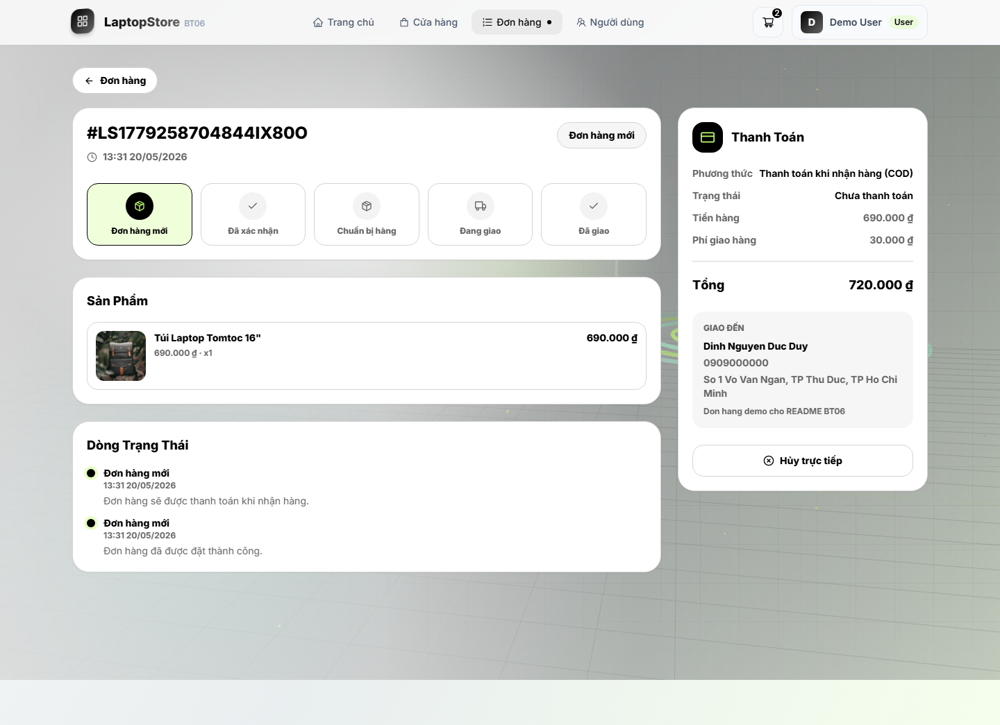 | 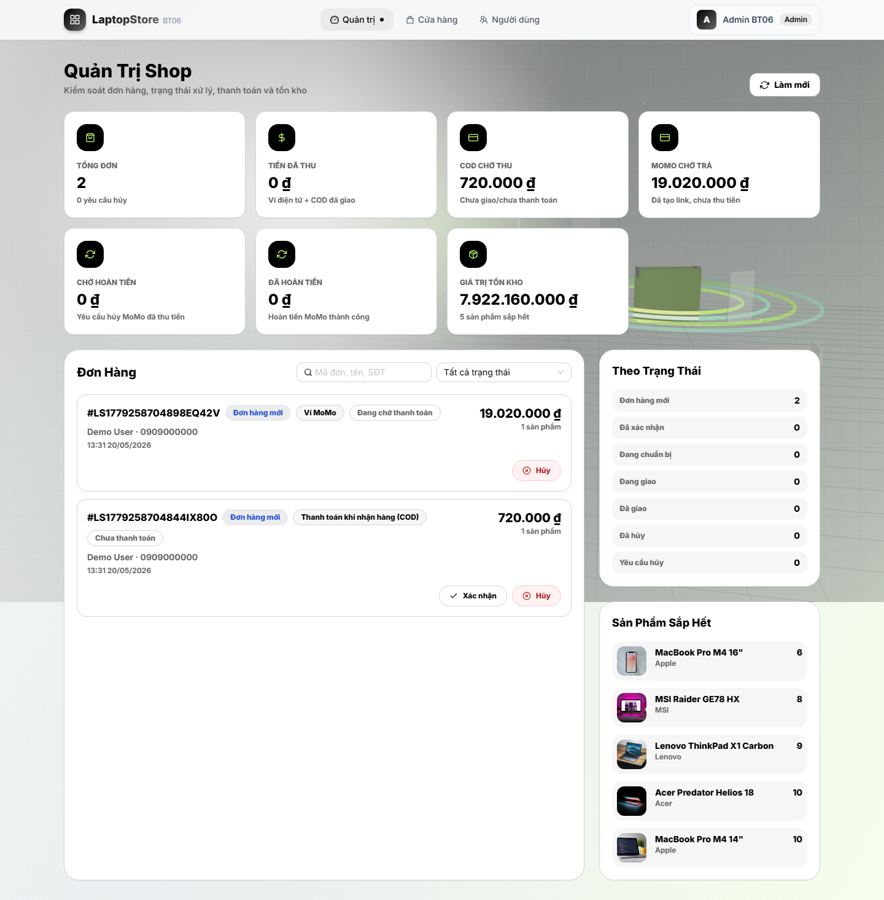 |

**Cách chạy:**
```bash
# Backend
cd BT06_23110193_DinhNguyenDucDuy/ExpressJS01
npm install
npm run seed
npm run dev    # http://localhost:8080

# Frontend
cd ../ReactJS01
npm install
npm run dev    # http://localhost:5173
```

Tài khoản seed:

```text
User:  demo@bt06.local  / 123456
Admin: admin@bt06.local / 123456
```

---

### 🎁 BT07 — LaptopStore Loyalty E-Commerce

> **Thư mục:** [`BT07_23110193_DinhNguyenDucDuy/`](./BT07_23110193_DinhNguyenDucDuy/)
> **README chi tiết:** [📄 Xem tại đây](./BT07_23110193_DinhNguyenDucDuy/README.md)

Bài tập cá nhân phát triển tiếp từ BT06, bổ sung hệ thống chăm sóc khách hàng: bình luận sản phẩm đã mua thành công, thưởng voucher hoặc điểm sau đánh giá, yêu thích, sản phẩm đã xem, kho điểm, hạng thành viên và quản lý khuyến mãi phía admin.

**Chức năng nổi bật:**
- ✅ **Bình luận xác thực** — chỉ đơn `DELIVERED` mới được đánh giá; mỗi đánh giá nhận voucher hoặc điểm
- ✅ **Yêu thích và đã xem** — lưu sản phẩm yêu thích, lịch sử xem gần nhất, sản phẩm tương tự
- ✅ **Thống kê sản phẩm** — hiển thị số khách mua và số khách bình luận
- ✅ **Voucher và điểm** — áp mã giảm giá, đổi điểm khi checkout; hoàn ưu đãi nếu hủy đơn
- ✅ **Hạng thành viên** — `MEMBER`, `SILVER`, `GOLD`, `DIAMOND` theo tổng chi tiêu
- ✅ **Admin loyalty** — quản lý voucher, kho điểm, hạng thành viên; xem sản phẩm và vị trí giao từng đơn

**Demo nhanh:**

| Kho thành viên | Checkout ưu đãi | Bình luận sản phẩm |
|---|---|---|
|  |  |  |

| Admin voucher và hạng thành viên | Admin xem sản phẩm và vị trí giao |
|---|---|
|  | 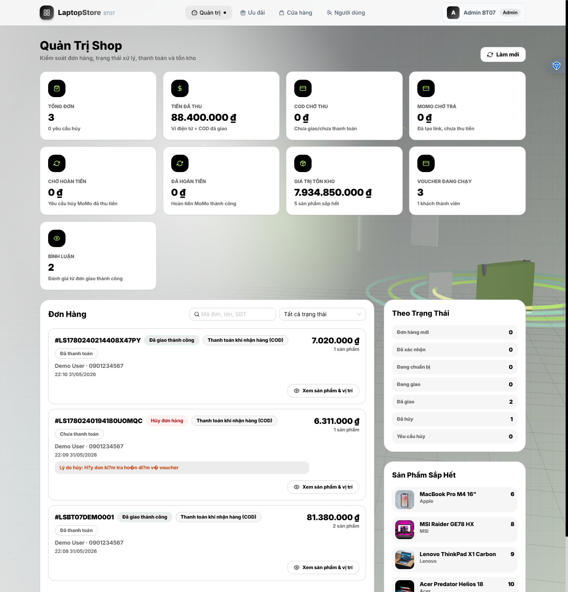 |

**Cách chạy:**
```bash
# Backend
cd BT07_23110193_DinhNguyenDucDuy/ExpressJS01
npm install
npm run seed
npm run dev    # http://localhost:8080

# Frontend
cd ../ReactJS01
npm install
npm run dev    # http://localhost:5173
```

Tài khoản seed:

```text
User:  demo@bt07.local  / 123456
Admin: admin@bt07.local / 123456
```

---
## 🛠 Yêu Cầu Hệ Thống

Tất cả bài tập trong repo này yêu cầu:

| Công cụ | Phiên bản tối thiểu | Tải về |
|---------|-------------------|--------|
| Node.js | >= 18.x | [nodejs.org](https://nodejs.org/) |
| MongoDB | >= 6.x | [mongodb.com](https://www.mongodb.com/try/download/community) |
| npm | >= 9.x | Đi kèm Node.js |
| Git | Bất kỳ | [git-scm.com](https://git-scm.com/) |

---

## 📌 Ghi Chú Chung

<div align="center">

*Repo được duy trì bởi **Đinh Nguyễn Đức Duy** — MSSV 23110193*
*Môn: Các Công Nghệ Phần Mềm Mới*

</div>

---

## Cập Nhật Demo Local

Phần này tổng hợp nhanh các bài đã kiểm tra và các trang/API demo cần mở khi chấm bài.

| Bài | Trạng thái kiểm tra | Lệnh chạy chính | Demo local |
|---|---|---|---|
| BT01 | Đã chạy `/crud` trả HTTP 200 | `cd BT01_23110193_DinhNguyenDucDuy && npm start` | `http://localhost:8088/crud`, `/get-crud`, `/edit-crud?id=<userId>` |
| BT02 | Đã cài dependency, API bảo vệ trả `401` khi chưa đăng nhập | `cd BT02_EditProfile_23110193_DinhNguyenDucDuy/EditProfile && npm install && npm start` | `POST http://localhost:3002/api/auth/edit-profile` |
| BT03(NHOM) | Module Redux/ProfilePage, không có server độc lập | Copy `redux/` và `pages/ProfilePage.jsx` vào frontend nhóm | `/profile`, `/user/profile`, `/admin/profile`, `/login`, `/register` |
| BT04 | Backend `/` và `/v1/api/products` trả HTTP 200; frontend build thành công | Backend: `npm run dev`; Frontend: `npm run dev` | `/`, `/login`, `/register`, `/forgot-password`, `/shop`, `/product/:id`, `/profile`, `/user` |
| BT04(Nhóm) | Đã đóng gói source sạch từ `group/hcmute-student-consulting`; không đưa `.git`, `node_modules`, `build`, `.env` | Backend: `npm run dev`; Frontend: `npm start` | `/admin/cms`, `/faq`, `/search`, `/forum`, `/api/admin/articles`, `/api/faqs`, `/api/search`, `/api/forum/threads` |
| BT05 | Backend top products và shop API trả dữ liệu; README/ảnh demo đã cập nhật đủ | Backend: `npm run dev`; Frontend: `npm run dev` | `/`, `/login`, `/register`, `/forgot-password`, `/shop`, `/product/:id`, `/profile`, `/v1/api/products/top` |
| BT06 | Backend COD/MoMo sandbox, giỏ hàng, orders, admin dashboard và ảnh demo đã cập nhật đủ | Backend: `npm run dev`; Frontend: `npm run dev` | `/cart`, `/checkout`, `/payment/momo-return`, `/orders`, `/orders/:id`, `/admin`, `/v1/api/momo/ipn` |
| BT07 | Review xác thực, voucher, kho điểm, hạng thành viên, yêu thích, đã xem và admin loyalty đã kiểm tra đủ | Backend: `npm run seed && npm run dev`; Frontend: `npm run dev` | `/store`, `/product/:id`, `/checkout`, `/admin`, `/admin/loyalty` |

BT02 đã được bổ sung README riêng tại [`BT02_EditProfile_23110193_DinhNguyenDucDuy/README.md`](./BT02_EditProfile_23110193_DinhNguyenDucDuy/README.md).
